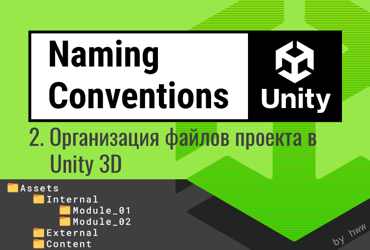

# Часть 2  - Организация файлов проекта в Unity 3D

**Автор:** Валерия Пудова (hww)  
**Telegram:** [@core_systems_eng](https://t.me/core_systems_eng)  
**Email:** [valery.hww@gmail.com](mailto:valery.hww@gmail.com)  
**Дата публикации:** 05.10.2022



---

## Аннотация

Для упрощения рабочего процесса, а также для быстрого погружения в работу новых сотрудников, необходим свод правил для организации файлов внутри проекта. В этом документе предлагается вариант общей структуры проекта, а также приводятся некоторые рекомендации по созданию программных модулей игры.

Этот документ является частью серии статей на тему структурирования игрового проекта.

---

## Теги

`#unity` `#unity3d` `#namingconvention` `#gamedev` `#gamedeveloper` `#gamedevelopment` `#indiedev` `#indiegaming` `#indiegamedev`

---

## История обновлений

| Дата | Версия | Описание |
|------|--------|----------|
| 06.10.2022 | R01 | Первая опубликованная версия |

---

## Содержание

- [Часть 2  - Организация файлов проекта в Unity 3D](#часть-2----организация-файлов-проекта-в-unity-3d)
  - [Аннотация](#аннотация)
  - [Теги](#теги)
  - [История обновлений](#история-обновлений)
  - [Содержание](#содержание)
  - [Введение](#введение)
  - [Корневая папка проекта](#корневая-папка-проекта)
    - [Специальные папки Unity](#специальные-папки-unity)
    - [Скрытые ассеты Unity](#скрытые-ассеты-unity)
  - [Аспекты файлов](#аспекты-файлов)
    - [По содержимому файла (Gist)](#по-содержимому-файла-gist)
    - [Группы по содержимому файла (Gist Group)](#группы-по-содержимому-файла-gist-group)
    - [Тип файла (Type)](#тип-файла-type)
    - [Группа типов файлов (Team)](#группа-типов-файлов-team)
    - [Происхождение файла (Origin)](#происхождение-файла-origin)
    - [Другие аспекты](#другие-аспекты)
  - [Именование папок по различным аспектам файлов](#именование-папок-по-различным-аспектам-файлов)
  - [Оптимизация глубины иерархии](#оптимизация-глубины-иерархии)
  - [Наименование папок проекта в корневом директории](#наименование-папок-проекта-в-корневом-директории)
  - [Директории второго уровня](#директории-второго-уровня)
    - [Internal](#internal)
    - [External](#external)
  - [Специальные папки проекта](#специальные-папки-проекта)
  - [Содержимое папок Code и Tools](#содержимое-папок-code-и-tools)
    - [Модули](#модули)
    - [Пример модулей](#пример-модулей)
    - [Структура модуля](#структура-модуля)
      - [1. IGM-модуль](#1-igm-модуль)
      - [2. UPM-модуль](#2-upm-модуль)
  - [Выводы](#выводы)
  - [Ссылки на источники](#ссылки-на-источники)

---

## Введение

Основная цель вдумчивого структурирования проекта — упрощение рабочего процесса, а также сокращение времени погружения в работу новых сотрудников. Кроме этого, необходимо учесть рабочий процесс игровой студии и, по возможности, минимизировать взаимные коллизии, а также обеспечить разделение проекта на несколько рабочих репозиториев.

Цель данного исследования — предложить паттерны именования папок проекта как минимум на два уровня иерархии от корневого директория. Поэтому в первую очередь необходимо определить содержимое корневой папки.

---

## Корневая папка проекта

Корневая папка, в которой расположен игровой проект, также используется для специальных папок Unity [5]. Кроме этого, она используется для папок некоторых сторонних пакетов. Всё это приводит к тому, что в корневой папке будет контент, не подлежащий структурированию. Поэтому лучшей стратегией будет **не создавать слишком много элементов** в корневой папке проекта.

### Специальные папки Unity

Имеют ряд имён, которые Unity интерпретирует особенным образом, поэтому с содержимым таких папок следует обращаться особым образом. Например, чтобы исходный код инструментов редактора работал правильно, его необходимо поместить в папку с именем `Editor`.

Существуют три основные разновидности специальных папок:

1. **Absolute** — папка должна быть единственной и располагаться в корневой папке проекта. Внутри неё стоит помещать папку с именем модуля, для которого предназначены файлы. Это ограничение Unity.
2. **Relative** — папка может находиться в любом месте дерева. В этом случае файлы можно помещать непосредственно в неё, но лучше не использовать такую папку в корневом директории.
3. **Relative Merged** — папка может находиться в любом месте дерева, но её содержимое будет конкатенировано (объединено) в финальной сборке. Внутри неё также рекомендуется создавать подпапку с именем модуля.

Ниже приведён полный список специальных имён папок, используемых Unity.

| Имя папки | Тип | Описание |
|-----------|-----|----------|
| `Assets` | — | Корневая папка проекта. Содержит все ассеты, используемые проектом. |
| `Editor` | Relative | Папка для расширений редактора. Может быть помещена в любое место. |
| `Editor Default Resources` | Absolute | Ресурсы редактора, загружаемые по требованию методом `EditorGUIUtility.Load`. Расположена в корне. |
| `Gizmos` | Absolute | Пользовательские Gizmos редактора. Расположена в корне. |
| `Plugins` | Absolute | Сторонние пакеты Unity устанавливаются именно сюда. Содержимое компилируется до остальных файлов, что можно использовать для разбиения на модули [6]. |
| `Resources` | Relative Merged | Файлы, доступные для загрузки в рантайме. Возможность размещения в любом месте — ценное свойство. |
| `Standard Assets` / `Pro Standard Assets` | Absolute | Используются для некоторых пакетов Unity. |
| `StreamingAssets` | Absolute | Для файлов, загружаемых или сохраняемых в рантайме. Расположена в корне. |

### Скрытые ассеты Unity

Редактор Unity полностью игнорирует файлы и папки, которые:

- Имеют имя `cvs`;
- Начинаются с символа `.`;
- Заканчиваются символом `~`;
- Имеют расширение `.tmp`.

---

## Аспекты файлов

В интернете существует множество рекомендаций и соглашений по структурированию проекта [1, 2, 3, 4]. Однако для принятия решений лучше самостоятельно проанализировать ваш проект и структурировать его. И начинать следует с классификации файлов по их **аспектам**.

Любой файл может иметь множество аспектов и теоретически может быть расположен в разных местах. Объединять файлы в папки можно по одному из аспектов.

### По содержимому файла (Gist)

Чем фактически является объект внутри файла: `TinyHouse`, `LargeTower`.

### Группы по содержимому файла (Gist Group)

Группа, в которую входит объект: `Maps`, `Characters`, `Vehicles`, `Weapons`, `Effects`, `Terrain`, `Background`, `Props`, `Vegetation`, `Details`.

В некоторых студиях над такими группами работают разные команды, что позволяет разделить зоны ответственности и минимизировать взаимные коллизии.

### Тип файла (Type)

Тип файла без интерпретации содержимого: `Models`, `Textures`, `Materials`, `Particles`, `Prefabs`, `Scenes`.

Тип файла часто не сообщает о содержимом (например, в префабе может быть что угодно). Поэтому именование папок по типу нецелесообразно на верхних уровнях. Если такие имена и использовать, то только в самом низу иерархии.

### Группа типов файлов (Team)

Без оценки содержимого некоторые типы можно собрать в более крупные группы, над которыми работает отдельная команда проекта. Примеры:

- `Art` — визуальный контент арт-департамента.
- `Design` — префабы и ассеты, созданные дизайнерами.
- `Audio` — звуковые файлы, префабы, настройки миксера.
- `Code` — файлы исходного кода игры.
- `Tools` — файлы исходного кода инструментов.

В названиях групп не следует использовать названия типов. Например, группа `Audio` названа так, потому что в ней могут находиться не только звуковые файлы, но и настройки миксера, префабы и другие объекты.

При необходимости папки можно группировать с помощью префикса: `GameArt`, `GameDesign`, `GameAudio`, `GameCode`.

### Происхождение файла (Origin)

Файлы большого проекта могут иметь разное происхождение: созданные внутри студии (`Internal`) или приобретённые (`External`).

Внешние модули не должны сильно модифицироваться, чтобы сохранять возможность обновления. Если студия вносит значительные изменения, необходимо:

1. Предложить изменения автору и оставить модуль внешним;
2. Реструктурировать модуль во внутренний.

### Другие аспекты

Их множество. Например, аспект процедурной генерации позволяет выделить папку `Procedural`, а исходные шаблоны — в `Templates`.

---

## Именование папок по различным аспектам файлов

Разделение по аспекту `Team` положительно влияет на работу студии. Проект структурируется так, чтобы изменения файлов и структуры вносили только их создатели. Для этого в Unity есть инструменты: аддитивные сцены, иерархические префабы, префаб-варианты и другие.

  
*Рисунок 1 — Зависимости между департаментами*

На основе диаграммы можно выделить следующие зависимости:

1. **Tools Programmers** — работают только со своим контентом.
2. **Game Programmers** — работают со своим контентом и контентом Tools.
3. **Art Department** — работают со своим контентом и контентом Tools.
4. **Game Designers** — требуют наибольший объём файлов:
   - На этапе **pre-production** — Game Code и Tools.
   - На этапе **production** — все файлы проекта.

Важно отделить код инструментов (`ToolsCode`) от кода игры (`GameCode`), чтобы первый не зависел от второго. Это минимизирует необходимость изменений в Art-департаменте по мере разработки кода игры.

С учётом высокой важности аспектов `Team` и `Origin`, сквозной шаблон именования папок может выглядеть так:

```
(1) {Team}/{Origin}/{GistGroup}/{Gist}/{Type}/
```

**Примеры:**

```text
/Art/External/Explosions/GrenadeExplosions/Prefabs/SmallGrenadeExplosion
/Art/External/Explosions/GrenadeExplosions/Textures/BlackSmoke.tga
```

---

## Оптимизация глубины иерархии

Желательно избегать глубокой вложенности. Человек легко ориентируется в файловой системе не более чем в трёх уровнях иерархии. Сигнатура положения файла состоит из первых трёх элементов пути, и на этом уровне дизайнер должен легко находить искомый элемент.

При этом, чем меньше папок в корне, тем глубже может быть иерархия. Если папка верхнего уровня всего одна, её можно мысленно игнорировать — так же, как мы игнорируем папку `Assets`.

Для минимизации глубины иерархии можно использовать сокращённый паттерн:

```
(2) {Team}/{Origin}/{GistGroup}/{Gist|Type}/
```

**Примеры с использованием Gist:**

```text
/Art/Internal/Architecture/LargeTower/LargeTower.mb
/Art/Internal/Architecture/LargeTower/LargeTower.tga
/Art/Internal/Architecture/TinyHouse/TinyHouse.mb
/Art/Internal/Architecture/TinyHouse/TinyHouse.tga
```

**Примеры с использованием Type:**

```text
/Art/Internal/LensFlares/Textures/LensFlares_01.tga
/Art/Internal/LensFlares/Models/LensFlares_01.mb
```

Для геймдизайнеров аспект `Origin` чаще всего избыточен, так как все файлы дизайна проходят адаптацию и рефакторинг внутри студии. Поэтому для них паттерн сокращается до:

```
(3) {Team}/{GistGroup}/{Gist|Type}/
```

**Примеры:**

```text
/Design/Actors/Cyborg/RedCyborg.prefab
/Design/Actors/Cyborg/GreenCyborg.prefab
```

---

## Наименование папок проекта в корневом директории

В корневую папку `Assets` следует помещать папки с наиболее обобщёнными названиями по департаментам:

- `Art` — для художников;
- `Design` — для геймдизайнеров;
- `Audio` — для звукорежиссёров;
- `Code` — для программистов игровой логики;
- `Tools` — для программистов инструментов.

**Рекомендация:** если необходимо группировать кастомные папки проекта, используйте префикс — аббревиатуру проекта или компании (например, `Prj_Art`, `Prj_Code`).

---

## Директории второго уровня

На втором уровне разработчики отделов могут структурировать файлы по своему усмотрению, но спецификация базовых правил упрощает кросс-департаментное взаимодействие. Здесь ключевым становится аспект **Origin**.

### Internal

Папка для пакетов и систем, разработанных внутри студии. Каждый пакет структурируется согласно соглашению из раздела «Структура модуля». Пакет может подключаться как изолированный git-субмодуль.

### External

Внешние плагины и ассеты (OpenVR, HTC, Steam, Photon, Emerald и др.). Пакеты хранятся строго в том виде, в котором приобретены. При активной модификации внешнего пакета его следует перенести в `Internal`.

Папка `External` организуется по паттерну:

```
(4) External/{Vendor|Category}/{PackageName}
```

Где используется:

- `Vendor` — имя производителя;
- `Category` — категория пакета (согласно Asset Store или OpenUPM).

Примеры категорий: `VisualScripting`, `Terrain`, `Animation`, `Utilities`, `AI`, `ParticlesAndEffects`, `Others`.

---

## Специальные папки проекта

Предназначены для особых случаев и могут использоваться в любом месте иерархии для повышения понимаемости структуры.

| Папка | Назначение |
|-------|------------|
| `Scenes` | Сцены, необходимые для модуля. Аспект Type. |
| `Maps` | Финальные игровые локации. Распределяются по департаментам. Пример: `/Design/Maps/FishingVillage.unity` |
| `Examples` | Файлы для демонстрации примеров. Могут игнорироваться в CI/CD. |
| `Ignore` | Игнорируется VCS (через `.gitignore`), но видна в Unity. Личная «песочница» сотрудника. |
| `Experimental` | R&D-файлы. Организуются по паттерну `Experimental/{ModuleName}.{SubmoduleName}`. После исследований переносятся в `Internal` или удаляются. |
| `Procedural` | Файлы, сгенерированные процедурными инструментами. Защищены от ручного редактирования. |
| `Templates` | Исходные шаблоны для процедурного генератора. |
| `Sources` | Исходники CCD-инструментов (`.max`, `.blend`, `.psd`). Лучше хранить вне проекта, но если внутри — только в папке `Sources`, чтобы CI/CD исключала их из сборки. |

---

## Содержимое папок Code и Tools

Эти директории предназначены для инженеров. Контент организован в виде функциональных модулей. Внутри модуля могут находиться сопутствующие ресурсы (шрифты, текстуры, тестовые сцены), необходимые для его автономной работы.

Базовые поддиректории:

- `Internal` — внутренние модули;
- `External` — сторонние библиотеки;
- `Scenes` — общие отладочные сцены программистов.

### Модули

Внутриигровая архитектура должна быть строго разделена на модули. Модуль — это функциональный фрагмент игры или фреймворк, оформленный в виде отдельной папки. Внутри модуля действуют те же правила, что и для корневой папки проекта.

Такая структура позволяет при необходимости превратить модуль в UPM-пакет для распространения через корпоративный реестр.

Паттерн именования модулей:

```
(6) /Code/Internal/{ModuleName}.{SubmoduleName}/
```

### Пример модулей

```text
Code/                              # Корневой каталог программистов
├── External/                      # Сторонние модули
└── Internal/                      # Собственные модули
    ├── Game/                      # Основной игровой модуль
    ├── Game.Audio/                # Звуковой субмодуль
    ├── AI/                        # Базовый AI-модуль
    ├── AI.Crowd/                  # Симуляция толпы
    ├── AI.Melee/                  # Ближний бой
    └── AI.PathFinding/            # Поиск путей
```

### Структура модуля

Модули делятся на два типа: **IGM** (In Game Module) и **UPM** (Unity Package Manager).

#### 1. IGM-модуль

Локальный модуль для игровой логики или инструментов редактора.

```text
%ModuleName%/
├── README.md                      # Документация
├── Scripts/                       # Исходный код (C#)
├── Editor/                        # Скрипты расширения редактора
├── Prefabs/                       # Префабы модуля
├── Art/                           # Визуальный контент
├── Audio/                         # Звуковое сопровождение
├── Scenes/                        # Тестовые сцены
├── Examples/                      # Примеры использования
│   └── Example_01/                # Изолированный кейс
└── Resources/
    └── %ModuleName%/              # Ресурсы для Resources.Load()
```

**Важно:** внутри папки `Resources` всегда создавайте подпапку с уникальным именем модуля, чтобы избежать конфликтов имён при сборке.

#### 2. UPM-модуль

Чтобы преобразовать IGM в UPM-пакет, необходимо:

1. Добавить в корень `package.json` с метаданными, версией и зависимостями.
2. Переименовать `Examples` в `Examples~` — это скроет папку от автоматического импорта, позволяя загружать примеры опционально через Package Manager.
3. Добавить `LICENSE` и `CHANGELOG.md` для работы CI/CD.

---

## Выводы

Игровой студии необходимо непрерывно развивать и поддерживать систему организации проектов и правил именования файлов и папок с учётом масштабирования команды. Привести большой проект к стройной, интуитивно понятной системе — сложная задача. Чем больше команда, тем выше цена ошибки, а хаотичная структура усложняет разработку многократно.

На основе индустриальных источников и личного R&D-опыта в этом документе сформулирован последовательный подход к структурированию проекта, доказавший свою эффективность на практике.

В следующей статье цикла будут детально рассмотрены частные вопросы организации структуры по департаментам студии: Art, Design, Audio.

---

## Ссылки на источники

- [1] [50 Tips and Best Practices for Unity](http://www.gamasutra.com/blogs/HermanTulleken/20160812/279100/50_Tips_and_Best_Practices_for_Unity_2016_Edition.php) — Herman Tulleken, 2016.
- [2] [Unreal Engine Assets Naming Convention](https://wiki.unrealengine.com/Assets_Naming_Convention)
- [3] [Unity Project Style Guide](https://github.com/timdhoffmann/unity-project-style-guide)
- [4] [Unity Best Practices](http://www.glenstevens.ca/unity3d-best-practices/)
- [5] [Unity Manual: Special Folder Names](https://docs.unity.cn/ru/2021.1/Manual/SpecialFolders.html)
- [6] [Unity Manual: Special Folders and Script Compilation Order](https://dev.rbcafe.com/unity/unity-5.3.3/en/Manual/ScriptCompileOrderFolders.html)
- [7] Gregory J. *Game Engine Architecture*. – 3rd Edition, AK Peters/CRC Press, 2018.
