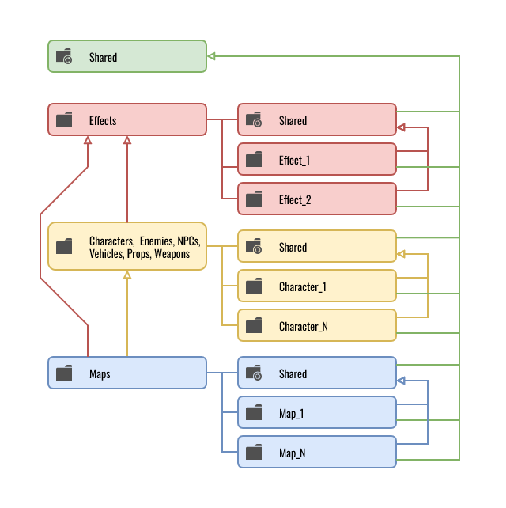
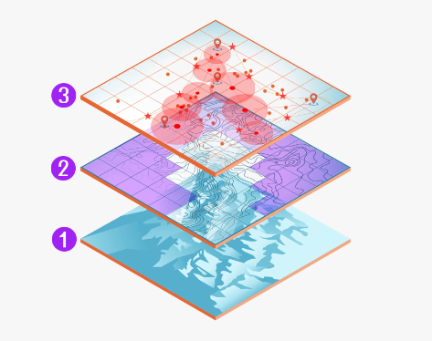
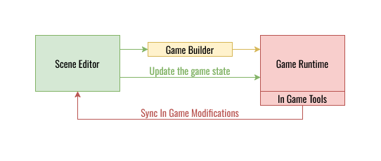

# Организация Art- и GD-данных в Unity 3D

## Часть 3 из серии статей «Структурирование игрового проекта»

**Автор:** Валерия Пудова (hww)  
**Telegram:** @core_systems_eng  
**Email:** valery.hww@gmail.com  
**Дата:** 22.10.2022


---

## 📌 Содержание

- [Организация Art- и GD-данных в Unity 3D](#организация-art--и-gd-данных-в-unity-3d)
  - [Часть 3 из серии статей «Структурирование игрового проекта»](#часть-3-из-серии-статей-структурирование-игрового-проекта)
  - [📌 Содержание](#-содержание)
  - [Введение](#введение)
  - [Имена папок по аспектам](#имена-папок-по-аспектам)
  - [Особенности аспекта Type](#особенности-аспекта-type)
  - [Визуальный контент в проекте](#визуальный-контент-в-проекте)
    - [Структура папки External](#структура-папки-external)
    - [Структура папки Internal](#структура-папки-internal)
      - [Папка Shared](#папка-shared)
      - [Папки Characters и Enemies](#папки-characters-и-enemies)
      - [Папки Vehicles, Weapons, Props, Vegetation, Backgrounds](#папки-vehicles-weapons-props-vegetation-backgrounds)
      - [Папка Effects](#папка-effects)
      - [Папка Maps](#папка-maps)
      - [Папки GUI и GUIMaps](#папки-gui-и-guimaps)
      - [Использование Labels (Меток)](#использование-labels-меток)
  - [Визуальный контент в сцене](#визуальный-контент-в-сцене)
  - [Игровой контент в проекте](#игровой-контент-в-проекте)
    - [Именование префабов](#именование-префабов)
  - [Игровой контент в сцене](#игровой-контент-в-сцене)
    - [Различные аспекты игровых объектов](#различные-аспекты-игровых-объектов)
    - [Структура игровых данных в сцене](#структура-игровых-данных-в-сцене)
    - [Именование префабов в сцене](#именование-префабов-в-сцене)
  - [Композиция префабов](#композиция-префабов)
  - [Инструменты разработки (Tools)](#инструменты-разработки-tools)
    - [Обязательный стек внутренних инструментов студии](#обязательный-стек-внутренних-инструментов-студии)
  - [Результат](#результат)
  - [Выводы](#выводы)
  - [Ссылки на источники](#ссылки-на-источники)

---

## Введение

В работе над крупным игровым проектом необходимо структурировать самые разные данные. Эта работа осуществляется каждым департаментом в отдельности, однако требуются и общие сквозные правила для всей студии.

Невозможно разработать универсальную спецификацию структуры, которая идеально подойдёт под требования абсолютно любого проекта, но базовые принципы продуманного подхода можно адаптировать под любые задачи.

В этом документе описаны методы структурирования данных департаментов Art (художники) и GD (геймдизайнеры). Материал разделён на пять логических блоков:

- **Визуальный контент в проекте** — структура файлов Art-департамента.
- **Визуальный контент в сцене** — организация иерархии сцен Art-департамента.
- **Игровой контент в проекте** — структура файлов GD-департамента.
- **Игровой контент в сцене** — организация данных в геймдизайнерских сценах.
- **Инструменты разработки** — задачи автоматизации для Tools-программистов.

---

## Имена папок по аспектам

Ранее были подробно описаны различные аспекты файлов и папок [2]. Ниже приведена краткая выжимка аспектов и типовых имён для быстрого проектирования структуры:

| **Аспект**       | **Описание**                                    | **Примеры значений**                                                                                 |
| :--------------- | :---------------------------------------------- | :--------------------------------------------------------------------------------------------------- |
| **Team**         | Департамент                                     | `Art`, `Design`, `Audio`, `Code`, `Tools`                                                            |
| **Origin**       | Происхождение                                   | `Internal` (внутренний), `External` (внешний)                                                       |
| **GistGroup**    | Сущностная группа                               | `Characters`, `Enemies`, `Props`, `Vehicles`, `Effects`, `Maps`, `GUI`                               |
| **Gist**         | Индивидуальная сущность                         | `RedCyborg`, `Minigun`, `TitleScreen`                                                                |
| **Type**         | Технический тип файла                           | `Models`, `Materials`, `Textures`, `Animations`, `Scenes`, `Prefabs`, `Particles`, `Shaders`, `Sounds` |

---

## Особенности аспекта Type

Зачастую тип файла совершенно не сообщает о его фактическом наполнении. Например, файл с расширением `.prefab` может содержать внутри себя что угодно: от визуального эффекта взрыва и анимированного персонажа до невидимого логического контроллера сцены. Кроме того, типов файлов существует слишком много, что порождает избыточную вложенность папок.

Именование каталогов по типу (`Models`, `Textures`) выглядит нецелесообразным. Если такие папки и используются, то их место — исключительно на самом нижнем уровне дерева файлов. Внедрение строгой системы префиксов (описанной в Части 1) позволяет полностью отказаться от папок типов: нет никакого смысла создавать папку `Textures`, если имена всех текстур и так начинаются с префикса `T_`.

Для минимизации глубины структуры применяется выбор одного из двух аспектов: либо `Gist`, либо `Type`. В паттернах это отображается выражением `{Gist|Type}`. При необходимости его можно трактовать как подпапки `{Gist}/{Type}`, но гораздо важнее соблюдать выбранный подход единообразно во всём проекте.

---

## Визуальный контент в проекте

Структура папок художников зависит от двух ключевых факторов:

1. **Технические ограничения** — инструменты разработки (DCC), техническое задание, требования к производительности и специфика архитектуры игрового движка.
2. **Психология восприятия** — художник бессознательно моделирует объект так, как он устроен в реальности. Однако виртуальный мир устроен иначе: чем выше реализм и детализация, тем сильнее программная структура объекта отдаляется от бытового представления.

**Пример.** Если ваза с цветами должна разбиваться в игре, художнику необходимо создать:
- базовую цельную модель;
- модель из физических осколков;
- настроить физические коллайдеры для каждого фрагмента;
- прикрепить систему частиц для имитации мелкой крошки.

Все эти нюансы структурируются по ходу производства, но базовым для арт-департамента является паттерн **(1)**:

```
(1) /{Team}/{Origin}/{GistGroup}/{Gist|Type}/
```

**Пример реализации:**

```
/Art/Internal/Characters/RedCyborg/
```

---

### Структура папки External

Если вы приобретаете сторонние ассеты и планируете обновлять их из Asset Store / OpenUPM в процессе разработки, их контент **запрещено модифицировать**. Они хранятся изолированно в папке `External` по паттерну **(2)**:

```
(2) /{Team}/External/{AssetCategory|Vendor}/{AssetName}
```

Классификация по категориям (`AssetCategory`) более интуитивна для человека. Рекомендуемые папки категорий:

- `VisualScripting`
- `Terrain`
- `Animation`
- `Utilities`
- `AI`
- `ParticlesAndEffects`
- `Others`

Если ассет гибридный и подходит под несколько категорий, ему волевым решением присваивается одна наиболее приоритетная.

---

### Структура папки Internal

Здесь находятся ассеты, создаваемые внутри студии. Их структура динамична. Первый уровень иерархии папки `Internal` отдаётся под аспект `GistGroup`:

- `Shared/` — универсальный контент, доступный для использования в любой точке проекта (текстуры шума, градиенты, базовые примитивы мешей с кастомными UV).
- `Characters/` — основные персонажи игры.
- `Enemies/` (или `Mobs/`) — персонажи противников.
- `Vehicles/` — транспорт (автомобили, вертолёты, лодки).
- `Weapons/` — оружие, не привязанное жёстко к конкретному актёру.
- `Props/` (или `Details/`) — мелкие объекты заполнения локаций.
- `Vegetation/` (или `Plants/`) — деревья, кусты, трава.
- `Backgrounds/` — текстуры неба, импосторы, дальние планы.
- `Effects/` — визуальные эффекты (VFX).
- `Maps/` — файлы игровых локаций.
- `GUI/` — текстуры, атласы и материалы интерфейса.
- `GUIMaps/` — сцены вёрстки интерфейса.

При отсутствии избытка файлов в `Shared` они лежат прямо в корне папки. Иначе применяется паттерн **(3)**:

```
(3) /{Team}/{Origin}/Shared/{Gist|Type}/
```

Папка `Shared` может дублироваться на нижних уровнях иерархии, выполняя роль локального общего хранилища для конкретной группы.

> **Важно.** С точки зрения архитектуры зависимостей, папка `Maps` является главным потребителем — она ссылается на все остальные папки проекта, но из них никто не должен ссылаться на папки внутри `Maps`.



---

#### Папка Shared

В этой папке находится любой универсальный контент. Например:
- различные UV-текстуры;
- универсальные текстуры (типа `light-spot`);
- текстуры шума и градиенты;
- универсальные модели примитивов (`quad`, `triangle`, `cube`, `cone`) и их варианты со специфическими раскладками UV.

Если таких файлов немного и в проекте используется система префиксов, файлы могут находиться непосредственно в корне `Shared`. В противном случае используется паттерн **(3)**.

---

#### Папки Characters и Enemies

Если явных различий в логике между врагами и персонажами нет, объединяйте их в общую папку `Characters` по паттернам **(4)** и **(5)**:

```
(4) /{Team}/{Origin}/Characters/{Gist}/
(5) /{Team}/{Origin}/Characters/Shared/{Gist|Type}/
```

**Пример структуры:**

```
Characters/                     -- Каталог всех персонажей
├── RedCyborg/                  -- Папка конкретного персонажа
│   ├── Models/
│   ├── Materials/
│   └── Animations/
└── Shared/                     -- Общие элементы
    ├── Animations/             -- Анимации, подходящие всей структуре скелетов
    └── Equipment/              -- Общие элементы экипировки
        └── Backpack/           -- Конкретный меш экипировки
```

---

#### Папки Vehicles, Weapons, Props, Vegetation, Backgrounds

Необходимость таких папок обосновывается для каждого проекта в отдельности. Их внутренняя структура во многом повторяет структуру папки `Characters`.

---

#### Папка Effects

Вынесение VFX в отдельный каталог критически важно, если над эффектами в студии работают отдельные узкоспециализированные технические художники. Паттерн **(6)**:

```
(6) /{Team}/{Origin}/Effects/{GistGroup|Gist}/
```

**Пример:**

```
Art/Internal/Effects/Shared/              -- Базовые эффекты окружения
Art/Internal/Effects/GrenadeExplosions/   -- Эффекты взрывов гранат игрока
Art/Internal/Effects/BombExplosions/      -- Эффекты взрывов бомб противников
```

---

#### Папка Maps

Для управления множеством игровых зон применяется паттерн **(7)**:

```
(7) /{Team}/{Origin}/Maps/{MapName}/{Gist|Type}/
```

Внутри папки конкретной локации лежат **только те данные, которые используются исключительно на ней**:
- сцены;
- карты высот;
- запечённые или сгенерированные меши дорог/рек;
- процедурно сгенерированные коллайдеры (например, для деревьев).

**Использование ассетов из папки конкретной карты за её пределами строго запрещено.**

Локация с именем `Shared` внутри `Maps` выступает виртуальной картой, хранящей общие для всех уровней ассеты.

**Пример структуры локации:**

```
./Maps/ForestLevel/                  // имя локации
./Maps/ForestLevel/ForestLevel_01    // сцена локации (нумерация, если несколько)
./Maps/ForestLevel/Models            // процедурные модели этой локации
./Maps/ForestLevel/Materials         // материалы этой локации
./Maps/ForestLevel/Animations        // анимации для этой локации
./Maps/ForestLevel/Prefabs           // префабы для этой локации
```

---

#### Папки GUI и GUIMaps

Элементы UI оформляются как префабы (`GUI/`) или как отдельные сцены (`GUIMaps/`), структура которых полностью повторяет логику построения карт `Maps`.

---

#### Использование Labels (Меток)

Система встроенных меток (`Labels`) в Unity — это «перпендикулярный» взгляд на файловую структуру. Списки дефолтных меток (`Architecture`, `Audio`, `Character`, `Effect`, `Ground`, `Prop`, `Road`, `Sky`, `Terrain`, `Vegetation`, `Vehicle`, `Wall`, `Water`, `Weapon`) дублируют аспект `GistGroup`. Для правильно настроенной файловой структуры метки внутри `Internal` не требуются.

Их главная ценность — **маркировка внешнего контента (`External`)**. Поскольку структура папок сторонних плагинов хаотична, разметка каждого ключевого внешнего ресурса метками позволяет быстро находить нужные элементы через поисковую строку Unity, не перестраивая папки плагина вручную.

При таком подходе утилита автоматизации должна жестко контролировать, чтобы у каждого импортированного внешнего ассета была проставлена соответствующая метка.

---

## Визуальный контент в сцене

Для художника сцена — это географическая модель. Здесь ключевыми становятся аспекты:
- `Location` — сектор карты, улица;
- `LODLevel` — уровень детализации для оптимизации;
- `Domain` — целевое рантайм-назначение.

Поиск объектов в иерархии (`Hierarchy`) упрощается за счёт создания пустых (`dummy`) корневых объектов-контейнеров с ярким форматированием. Редактор Unity использует шрифты низкого качества, поэтому для надёжного визуального выделения категорий на любых экранах лучше всего себя показал префикс и суффикс из двойного дефиса `──`:

```
──StaticGeometry──       -- Статический меш локации (батчинг)
──DynamicGeometry──      -- Разрушаемые и интерактивные объекты
──Colliders──            -- Невидимая упрощённая физическая модель
──Lights──               -- Источники света и пробы освещения
──Cameras──              -- Камеры и триггеры зон CineMachine
```

Иерархия объектов внутри сцены организуется по паттерну **(8)**:

```
(8) /{Domain}/{Location}/{Gist|Prefab}/{LODLevel}/
```

Главное требование — сам корневой префаб обязан находиться на фиксированном, легко предсказуемом уровне вложенности сцены, какой бы сложной ни была структура его внутренних дочерних объектов.

> **Ограничение слоёв и тегов.** Система тегов (`Tags`) оправдана только тогда, когда объекту нужен строго один уникальный маркер, а их общее число в проекте жёстко лимитировано. Иконки (`Gizmos`) эффективнее назначать через исходный код типов, а не вручную. Слои (`Layers`) зарезервированы под физику (`Matrix`) и пайплайны рендеринга (Culling Masks). Использовать их для логического структурирования сцены запрещено.

---

## Игровой контент в проекте

Для геймдизайнера (GD) структура файлов аналогична художественной, но осложняется тем, что типы файлов скрывают суть (внутри `.asset` или `.prefab` может находиться любая конфигурация систем). Здесь критически важно повсеместное использование **префиксов и суффиксов**.

Главная цель — **полное разделение областей ответственности**. Изменения, вносимые дизайнерами в логику, не должны затрагивать файлы художников, и наоборот.

- Художники создают префабы с формой и визуалом объектов.
- Дизайнеры оборачивают их в **префаб-варианты** (`Prefab Variants`), навешивая компоненты рантайм-поведения.


Файлы геймдизайнеров организуются по паттерну **(9)**, где аспект происхождения `Origin` полностью исключён (все данные GD по определению уникальны для данной игры):

```
(9) /{Team}/{GistGroup}/{Gist}/
```

---

### Именование префабов

Префабы, установленные в сцене, должны сохранять своё первоначальное имя из файловой системы с добавлением нумерованного суффикса:

```
P_NPC_RedDrone_01
P_NPC_RedDrone_02
P_NPC_RedDrone_03
```

Имя префаба должно максимально точно описывать его тип, назначение, сущность и версию.

---

## Игровой контент в сцене

Сцена геймдизайнера — это отдельный логический слой карты локации, существующий параллельно с визуальным слоем художников. В ней **полностью отсутствует видимый контент**, а вся работа ведётся с:
- collision / navigation геометрией;
- зонами триггеров;
- точками спавна;
- путями патрулирования.

Видимость этих данных в редакторе эмулируется кастомными скриптами отрисовки `Gizmos`.

Разделение визуальной и логической составляющих на отдельные файлы сцен решает проблему совместной работы и позволяет процедурным генераторам автоматически обновлять навигационные сетки (`NavMesh`) при изменении геометрии художниками.



**Каждый слой представляет определённый вид данных:**

1. Визуальная модель мира.
2. Физическая модель мира (коллайдеры).
3. Игровые данные, необходимые для функционирования кода игры.

В реальных проектах слоёв может быть больше. Могут появиться процедурные слои, содержащие как игровые данные, так и оптимизированные версии визуальной или физической модели.

---

### Различные аспекты игровых объектов

В логической сцене декорации выносятся за скобки (воспринимаются как единый монолитный меш коллизии). Игровые сущности группируются по следующим аспектам:

- **Gist** — точная суть прототипа объекта.
- **Location / Zone** — привязка к конкретной триггерной или пространственной игровой зоне.
- **Category** (категория по рантайм-назначению):
  - `Gameplay` — интеракции, квесты, продвижение по сюжету.
  - `Combat` — объекты боевых систем, зоны арен.
  - `Camera` — управление поведением камер.
  - `Sound` — логические зоны запуска эмбиента и звуков.
  - `Dialogue` — триггеры и точки инициации систем диалогов.
  - `Particles` — логический запуск игровых систем частиц.
  - `Visibility` — зоны стриминга и Occlusion Culling.
  - `Global` — менеджеры и контроллеры, не вошедшие в другие группы.
- **Subcategory** (подкатегория по функции объекта):
  - `Actor Spawner` — точки генерации сущностей.
  - `Background Actors` — контроллеры фоновой симуляции.
  - `Regions` — триггерные объёмы со специфическими законами физики/геймплея.
  - `Spline` — направляющие кривые для движения или анимации.
  - `Traversal` — объекты паркура, лестницы, маркеры для прыжков ИИ.
  - `NavShapes` — ограничители зон перемещения (`NavMesh Obstacles`).
  - `Feature Overlays` — конфигурационные ноды вспомогательных систем.
- **Sets** — создаваемые дизайнером кастомные группы для быстрой фильтрации на конкретном уровне (например, `Teleports`, `Scriptable`, `Default`).

---

### Структура игровых данных в сцене

Поскольку в иерархии Unity нет папок, роль контейнеров выполняют пустые `GameObject`, имеющие свои координаты `Transform`. Использование пространственных игровых зон — самый эффективный метод группировки логики. Паттерн **(10)**:

```
(10) /{Location|Zone}/{Gist|Prefab}/
```

**Пример реализации:**

```
FactoryGates_Zone_01/                         -- Корневой объект зоны ворот фабрики
├── P_RedCyborgSpawner_01                     -- Спавнер первой волны врагов
├── P_RedCyborgSpawner_02                     -- Спавнер второй волны врагов
├── P_BigBossCyborgSpawner_01                 -- Точка появления босса
└── P_ControlTable_01                         -- Интерактивный пульт управления воротами
```

При большом количестве зон паттерн может быть модифицирован **(11)**:

```
(11) /{Location|Zone}/{Sublocation|Subzone}/{Gist|Prefab}/
```

> **Важно.** Если инструменты разработки на уровне кода редактора умеют фильтровать, группировать и подсвечивать объекты по всем остальным аспектам (`Category`, `Subcategory`, `Sets`), иерархическое дерево в сцене становится избыточным. В этом случае можно полностью отказаться от вложенности `GameObject`, расположив все элементы плоским списком в корне сцены по паттерну **(12)**:

```
(12) /{Gist|Prefab}/
```

**Пример плоской структуры:**

```
FactoryGates_Zone_01              -- Изолированная нода зоны ворот
FactoryWorkshop_Zone_01           -- Нода зоны цеха
P_RedCyborgSpawner_01             -- Плоский список независимых префабов
P_RedCyborgSpawner_02             
P_ControlTable_01                 
```

---

### Именование префабов в сцене

Каждый установленный в сцене экземпляр префаба обязан сохранять своё исходное имя из файловой системы с добавлением уникального цифрового суффикса:

```
P_NPC_RedDrone_01
P_NPC_RedDrone_02
P_NPC_RedDrone_03
```

Нумеровать необходимо **абсолютно каждый объект**.

---

## Композиция префабов

Префабы — мощный инструмент, но смешивание различных идиом их использования (`linked prefabs`, `nested prefabs`, `god prefabs`) мгновенно уничтожает стабильность проекта. Необходимо выбрать одну идиому для всей студии.

Иерархические префабы и префаб-варианты концептуально идентичны наследованию классов в ООП. Это хрупкая структура: неосторожное локальное изменение базового объекта может каскадно сломать логику сотен дочерних вариантов по всему проекту.

**Чтобы не допустить деградации структуры данных, внедрите правила:**

1. **По возможности избегайте глубокого наследования префабов.** Зачастую надёжнее и проще иметь два независимых префаба, чем сложный граф зависимостей.
2. **Жёсткий лимит вложенности вариантов — не более двух уровней.** Базовый префаб содержит костяк и логику актёра, а дочерний вариант — лишь подменяет визуальный материал или добавляет обвес.
3. **Запрещено модифицировать префаб внутри его внутренней иерархии.** Все параметры кастомизации выносятся на самый верхний корневой уровень и управляются через единый интерфейс скрипта-компонента (например, `DroneSettings`).

Паттерн для вложенных префабов **(13)**:

```
(13) /{Location|Zone}/{Gist|Prefab}/{GistGroup}/{Gist}
```

**Пример с использованием `Equipment` в качестве `GistGroup`:**

```
P_Enemy_RedDrone_01                      -- Верхний уровень префаба дрона
├── Model
├── Controller
├── Representation
└── Equipment/                           -- Дочерний префаб Minigun без модификаций
    └── P_Minigun
        ├── Model
        ├── Controller
        └── Representation
```

> Все параметры кастомизации дрона и его аксессуаров хранятся в компоненте `DroneSettings` на корневом уровне.

---

## Инструменты разработки (Tools)


Проектирование кастомного инструментария силами Tools-программистов и CTO — это единственный способ создать сложный коммерческий продукт с минимальными затратами, кратно повысив производительность труда дизайнеров и художников.

### Обязательный стек внутренних инструментов студии

1. **Система контроля версий и CI/CD ферма.** Базовый элемент инфраструктуры. Каждый разработчик должен иметь возможность через веб-панель фермы запустить автоматическую сборку билда с интересующей его картой, собранной напрямую из локальных файлов его рабочей станции.

2. **Project Management комплекс.** Интегрированные системы ведения задач, баг-трекинга и сквозного документирования архитектуры.

3. **Утилита управления ресурсами (Asset Renamer).** Специализированный инструмент для автоматического группового переименования, перенумерации и замены префиксов/суффиксов ассетов согласно принятым конвенциям студии. Утилита должна валидировать проект и вести строгий лог-файл изменений структуры для автоматического разрешения конфликтов слияния (`merge conflicts`) в Git.

4. **Рантайм-инструменты отладки и полировки (In-Game Tools).** Системы, работающие непосредственно в запущенной игре. Они позволяют QA-инженерам и геймдизайнерам анализировать состояния систем, изменять геймплейные параметры и логировать результаты на лету, полностью исключая необходимость перезапуска или перекомпиляции проекта.



---

## Результат

В результате, основные паттерны именования папок представлены в таблице ниже. Остальные паттерны могут быть добавлены по мере развития вашего проекта.

**Таблица 1. Сводные паттерны именования каталогов и иерархий**

| **Тип данных / Сфера применения**       | **Паттерн именования**                                                                      |
| :-------------------------------------- | :------------------------------------------------------------------------------------------ |
| **Внешний контент проекта**             | `/{Team}/External/{AssetCategory \| Vendor}/`                                               |
| **Визуальный контент проекта**          | `/{Team}/Internal/{GistGroup}/{Gist \| Type}/`                                              |
| **Визуальный контент сцены**            | `/{Domain}/{Location}/{Gist \| Prefab}/{LODLevel}/`                                         |
| **Игровой контент проекта**             | `/{Team}/{GistGroup}/{Gist}/`                                                               |
| **Игровой контент сцены**               | `/{Location \| Zone}/{Gist \| Prefab}/`                                                     |
| **Дочерний вложенный префаб**           | `/{Location \| Zone}/{Gist \| Prefab}/{GistGroup}/{Gist \| Prefab}/`                        |

---

## Выводы

- **Разделяйте** структуры файлов в каталогах и структуры объектов в сценах строго по изолированным департаментам.
- **Храните внешние ассеты (`External`)** отдельно от внутренних (`Internal`), не изменяя их структуру, но активно размечая их метками (`Labels`) для сквозного поиска.
- **Собирайте финальные карты локаций** из нескольких независимых сцен-слоёв (визуальный, физический, логический).
- **Жёстко ограничивайте глубину** вложенности папок и иерархий `GameObject` в сцене. Стремитесь к плоским структурам.
- **Не смешивайте идиомы** использования префабов. Ограничьте глубину наследования вариантов до двух уровней и управляйте кастомизацией только с верхнего корневого узла.
- **Контент общих каталогов (`Shared`)** должен быть строго ограничен по видимости и доступен для использования только на аналогичном или более низких уровнях иерархии.
- **Выделяйте ресурсы** студии на команду Tools-программистов. API редактора Unity позволяет написать весь необходимый арсенал автоматизации и рантайм-отладки.

Совершенствование структуры проекта и развитие внутренних инструментов автоматизации — это не разовая задача, а непрерывный R&D-процесс всей инженерной команды.

---

## Ссылки на источники

- [1] 📄 Именование файлов в Unity 3D (Часть 1)
- [2] 📄 Организация файлов проекта в Unity 3D (Часть 2)
- [3] 📄 [50 Tips and Best Practices for Unity](http://www.gamasutra.com/blogs/HermanTulleken/20160812/279100/50_Tips_and_Best_Practices_for_Unity_2016_Edition.php) by Herman Tulleken (08/12/16)
- [4] 📄 Unreal Engine Assets Naming Convention
- [5] 📄 [Unity Project Style Guide](https://github.com/timdhoffmann/unity-project-style-guide)
- [6] 📄 Unity Best Practices
- [7] 📄 Unity Manual: Special Folder Names
- [8] 📄 [Unity Manual: Script Compilation Order](https://docs.unity3d.com/Manual/ScriptCompileOrderFolders.html)
- [9] 📚 Gregory J. [Game Engine Architecture](https://www.gameenginebook.com/). – AK Peters/CRC Press, 2018.
- [10] 📄 [Game Programmer from Naughty Dog Talks Uncharted 4 Production Process](https://80.lv/articles/game-programmer-from-naughty-dog-talks-uncharted-4-production-process/)

