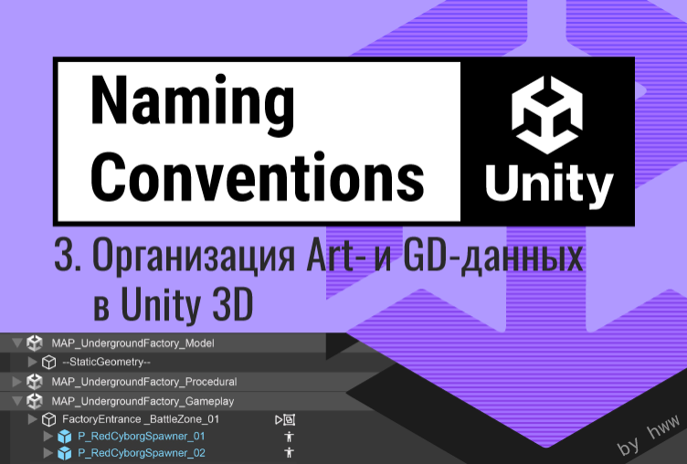
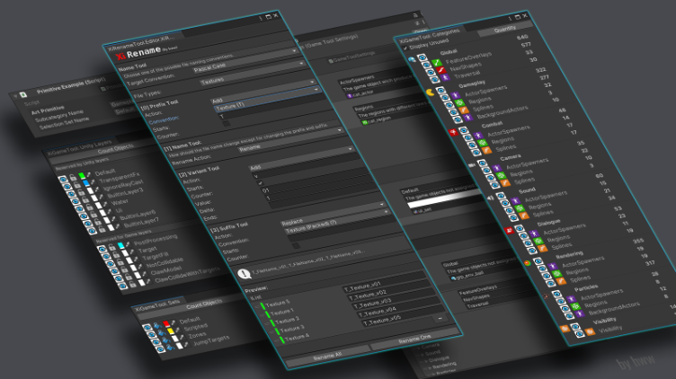

# Part 3 - Organization of Art and GD Data in Unity 3D

**Author:** Valeriya Pudova (hww)  
**Telegram:** @core_systems_eng  
**Email:** valery.hww@gmail.com  
**Date:** 22.10.2022



---

## 📌 Table of Contents

- [Part 3 - Organization of Art and GD Data in Unity 3D](#part-3---organization-of-art-and-gd-data-in-unity-3d)
  - [📌 Table of Contents](#-table-of-contents)
  - [Introduction](#introduction)
  - [Folder Names by Aspects](#folder-names-by-aspects)
  - [Specifics of the Type Aspect](#specifics-of-the-type-aspect)
  - [Visual Content in the Project](#visual-content-in-the-project)
    - [External Folder Structure](#external-folder-structure)
    - [Internal Folder Structure](#internal-folder-structure)
      - [Shared Folder](#shared-folder)
      - [Characters and Enemies Folders](#characters-and-enemies-folders)
      - [Vehicles, Weapons, Props, Vegetation, Backgrounds Folders](#vehicles-weapons-props-vegetation-backgrounds-folders)
      - [Effects Folder](#effects-folder)
      - [Maps Folder](#maps-folder)
      - [GUI and GUIMaps Folders](#gui-and-guimaps-folders)
      - [Using Labels](#using-labels)
  - [Visual Content in the Scene](#visual-content-in-the-scene)
  - [Game Content in the Project](#game-content-in-the-project)
    - [Prefab Naming](#prefab-naming)
  - [Game Content in the Scene](#game-content-in-the-scene)
    - [Various Aspects of Game Objects](#various-aspects-of-game-objects)
    - [Game Data Structure in the Scene](#game-data-structure-in-the-scene)
    - [Prefab Naming in the Scene](#prefab-naming-in-the-scene)
  - [Prefab Composition](#prefab-composition)
  - [Development Tools (Tools)](#development-tools-tools)
    - [Essential Internal Tools Stack](#essential-internal-tools-stack)
  - [Results](#results)
  - [Conclusions](#conclusions)
  - [References](#references)

---

## Introduction

Working on a large-scale game project requires structuring a wide variety of data. This work is performed by each department individually, but cross-cutting studio-wide conventions are also necessary.

It is impossible to develop a universal structure specification that perfectly fits the requirements of absolutely any project. However, the fundamental principles of a well-thought-out approach can be adapted to any needs.

This document describes methods for structuring data for the Art and GD (Game Design) departments. The material is divided into five logical sections:

- **Visual Content in the Project** — file structure of the Art department.
- **Visual Content in the Scene** — organization of scene hierarchies for the Art department.
- **Game Content in the Project** — file structure of the GD department.
- **Game Content in the Scene** — organization of data in game design scenes.
- **Development Tools** — automation tasks for Tools programmers.

---

## Folder Names by Aspects

Various aspects of files and folders have been described in detail previously [2]. Below is a summary of the aspects and their typical names for quick structure design:

| **Aspect**      | **Description**                              | **Example Values**                                                                                       |
| :-------------- | :------------------------------------------- | :------------------------------------------------------------------------------------------------------- |
| **Team**        | Department                                   | `Art`, `Design`, `Audio`, `Code`, `Tools`                                                                |
| **Origin**      | Origin                                       | `Internal` (in-house), `External` (third-party)                                                          |
| **GistGroup**   | Entity group                                 | `Characters`, `Enemies`, `Props`, `Vehicles`, `Effects`, `Maps`, `GUI`                                   |
| **Gist**        | Individual entity                            | `RedCyborg`, `Minigun`, `TitleScreen`                                                                    |
| **Type**        | Technical file type                          | `Models`, `Materials`, `Textures`, `Animations`, `Scenes`, `Prefabs`, `Particles`, `Shaders`, `Sounds`   |

---

## Specifics of the Type Aspect

File type often reveals nothing about its actual content. For example, a `.prefab` file can contain anything from a visual explosion effect and an animated character to an invisible logic controller. Moreover, there are too many file types, which leads to excessive folder nesting.

Naming directories by type (`Models`, `Textures`) is impractical. If such folders are used, they should be placed exclusively at the lowest level of the file tree. Implementing a strict prefix system (described in Part 1) allows complete elimination of type folders: there is no point in creating a `Textures` folder if all texture names already start with the `T_` prefix.

To minimize structure depth, choose either the `Gist` or `Type` aspect. In patterns, this is denoted as `{Gist|Type}`. If necessary, it can be interpreted as subfolders `{Gist}/{Type}`, but consistency across the project is more important.

---

## Visual Content in the Project

The folder structure for artists depends on two key factors:

1. **Technical constraints** — DCC tools, technical specifications, performance requirements, and game engine architecture specifics.
2. **Perceptual psychology** — artists intuitively model objects as they exist in reality. However, the virtual world differs: the higher the realism and detail, the further the programmatic structure deviates from everyday perception.

**Example.** If a flower vase must break in-game, the artist must create:
- a complete base model;
- a model of physical fragments;
- configured physics colliders for each fragment;
- a particle system to simulate small debris.

All these nuances are structured during production, but the base pattern for the Art department is **(1)**:

```
(1) /{Team}/{Origin}/{GistGroup}/{Gist|Type}/
```

**Implementation example:**

```
/Art/Internal/Characters/RedCyborg/
```

---

### External Folder Structure

If you acquire third-party assets and plan to update them from the Asset Store / OpenUPM during development, **their content must not be modified**. They are stored in isolation in the `External` folder according to pattern **(2)**:

```
(2) /{Team}/External/{AssetCategory|Vendor}/{AssetName}/
```

Categorization by `AssetCategory` is more intuitive for humans. Recommended category folders:

- `VisualScripting`
- `Terrain`
- `Animation`
- `Utilities`
- `AI`
- `ParticlesAndEffects`
- `Others`

If an asset is hybrid and fits multiple categories, assign it one highest-priority category.

---

### Internal Folder Structure

This folder contains in-house assets. Their structure is dynamic. The first level of the `Internal` folder hierarchy is allocated to the `GistGroup` aspect:

- `Shared/` — universal content usable anywhere in the project (noise textures, gradients, basic primitive meshes with custom UVs).
- `Characters/` — main game characters.
- `Enemies/` (or `Mobs/`) — enemy characters.
- `Vehicles/` — vehicles (cars, helicopters, boats).
- `Weapons/` — weapons not rigidly tied to specific actors.
- `Props/` (or `Details/`) — small environment filler objects.
- `Vegetation/` (or `Plants/`) — trees, bushes, grass.
- `Backgrounds/` — sky textures, impostors, distant backdrops.
- `Effects/` — visual effects (VFX).
- `Maps/` — game level files.
- `GUI/` — UI textures, atlases, and materials.
- `GUIMaps/` — UI layout scenes.

If there are not too many files in `Shared`, they can reside directly in the folder root. Otherwise, pattern **(3)** applies:

```
(3) /{Team}/{Origin}/Shared/{Gist|Type}/
```

The `Shared` folder can be duplicated at lower hierarchy levels, acting as a local common storage for a specific group.

> **Important.** From an architectural dependency perspective, the `Maps` folder is the primary consumer — it references all other project folders, but none of them should reference anything inside `Maps`.


---

#### Shared Folder

This folder contains any universal content. For example:
- various UV textures;
- universal textures (such as `light-spot`);
- noise and gradient textures;
- universal primitive models (`quad`, `triangle`, `cube`, `cone`) and their variants with specific UV layouts.

If there are few such files and a prefix system is used, files can reside directly in the `Shared` root. Otherwise, pattern **(3)** is used.

---

#### Characters and Enemies Folders

If there is no clear logical distinction between enemies and characters, combine them in a single `Characters` folder using patterns **(4)** and **(5)**:

```
(4) /{Team}/{Origin}/Characters/{Gist}/
(5) /{Team}/{Origin}/Characters/Shared/{Gist|Type}/
```

**Example structure:**

```
Characters/                     -- All characters
├── RedCyborg/                  -- Specific character folder
│   ├── Models/
│   ├── Materials/
│   └── Animations/
└── Shared/                     -- Shared elements
    ├── Animations/             -- Animations compatible with the skeleton structure
    └── Equipment/              -- Shared equipment elements
        └── Backpack/           -- Specific equipment mesh
```

---

#### Vehicles, Weapons, Props, Vegetation, Backgrounds Folders

The necessity of such folders is justified on a per-project basis. Their internal structure largely follows the `Characters` folder structure.

---

#### Effects Folder

Separating VFX into a dedicated directory is critical if effects are handled by specialized technical artists. Pattern **(6)**:

```
(6) /{Team}/{Origin}/Effects/{GistGroup|Gist}/
```

**Example:**

```
Art/Internal/Effects/Shared/              -- Basic environment effects
Art/Internal/Effects/GrenadeExplosions/   -- Player grenade explosion effects
Art/Internal/Effects/BombExplosions/      -- Enemy bomb explosion effects
```

---

#### Maps Folder

To manage multiple game zones, pattern **(7)** is used:

```
(7) /{Team}/{Origin}/Maps/{MapName}/{Gist|Type}/
```

Inside a specific level folder, place **only data used exclusively on that level**:
- scenes;
- heightmaps;
- baked or procedurally generated road/river meshes;
- procedurally generated colliders (e.g., for trees).

**Using assets from a specific map folder outside its boundaries is strictly prohibited.**

A level named `Shared` inside `Maps` serves as a virtual map storing assets common to all levels.

**Example level structure:**

```
./Maps/ForestLevel/                  -- Level name
./Maps/ForestLevel/ForestLevel_01    -- Level scene (numbered if multiple)
./Maps/ForestLevel/Models            -- Procedural models for this level
./Maps/ForestLevel/Materials         -- Materials for this level
./Maps/ForestLevel/Animations        -- Animations for this level
./Maps/ForestLevel/Prefabs           -- Prefabs for this level
```

---

#### GUI and GUIMaps Folders

UI elements are organized as prefabs (`GUI/`) or as separate scenes (`GUIMaps/`), whose structure mirrors the `Maps` folder logic.

---

#### Using Labels

Unity's built-in label system provides a "perpendicular" view of the file structure. Default labels (`Architecture`, `Audio`, `Character`, `Effect`, `Ground`, `Prop`, `Road`, `Sky`, `Terrain`, `Vegetation`, `Vehicle`, `Wall`, `Water`, `Weapon`) duplicate the `GistGroup` aspect. For a well-structured file system, labels inside `Internal` are unnecessary.

Their primary value is **tagging external content (`External`)**. Since third-party plugin folder structures are chaotic, marking each key external asset with appropriate labels allows quick searching via Unity's search bar without manually restructuring plugin folders.

With this approach, an automation utility should rigorously ensure that every imported external asset has a corresponding label assigned.

---

## Visual Content in the Scene

For an artist, the scene is a geographical model. Key aspects here are:
- `Location` — map sector, street;
- `LODLevel` — level of detail for optimization;
- `Domain` — runtime purpose.

Navigating the Hierarchy is simplified by creating empty (`dummy`) root container objects with distinct formatting. Since Unity's default font rendering is suboptimal, the most reliable visual distinction across different screens is achieved using a prefix and suffix of double dashes `──`:

```
──StaticGeometry──       -- Static batchable level meshes
──DynamicGeometry──      -- Destructible and interactive objects
──Colliders──            -- Invisible simplified physics collision model
──Lights──               -- Light sources and lighting probes
──Cameras──              -- Cameras and Cinemachine zone triggers
```

The scene object hierarchy follows pattern **(8)**:

```
(8) /{Domain}/{Location}/{Gist|Prefab}/{LODLevel}/
```

The key requirement is that the root prefab must reside at a fixed, predictable nesting level in the scene, regardless of how complex its internal child structure is.

> **Tag and Layer restrictions.** The tag system is only justified when an object needs exactly one unique marker, and the total number of tags is strictly limited. Icons (`Gizmos`) are more effectively assigned via type code rather than manually. Layers are reserved for physics (`Matrix`) and rendering pipelines (Culling Masks) — using them for logical scene structuring is prohibited.

---

## Game Content in the Project

For game designers (GD), the file structure is similar to the art structure but complicated by the fact that file types hide their purpose (any configuration can be inside `.asset` or `.prefab`). Here, **consistent use of prefixes and suffixes** is critical.

The primary goal is **complete separation of responsibilities**. Changes made by designers to logic should not affect artist files, and vice versa.

- Artists create prefabs with object form and visuals.
- Designers wrap them into **prefab variants**, attaching runtime behavior components.


Game designer files follow pattern **(9)**, where the `Origin` aspect is completely omitted (all GD data is inherently unique to this game):

```
(9) /{Team}/{GistGroup}/{Gist}/
```

---

### Prefab Naming

Prefabs placed in the scene should retain their original file system name with an added numbered suffix:

```
P_NPC_RedDrone_01
P_NPC_RedDrone_02
P_NPC_RedDrone_03
```

The prefab name should describe its type, purpose, entity, and version as precisely as possible.

---

## Game Content in the Scene

The game designer's scene is a separate logical layer of the level map, existing in parallel with the artist's visual layer. It contains **no visible content**, focusing on:
- collision / navigation geometry;
- trigger zones;
- spawn points;
- patrol paths.

Visibility of this data in the Editor is emulated via custom `Gizmos` rendering scripts.

Separating visual and logical components into separate scene files solves collaboration issues and allows procedural generators to automatically update navigation meshes (`NavMesh`) when artists modify geometry.


**Each layer represents a specific type of data:**

1. Visual world model.
2. Physics world model (colliders).
3. Game data required for game code functionality.

In real projects, there may be more layers. Procedural layers may appear, containing both game data and optimized versions of visual or physics models.

---

### Various Aspects of Game Objects

In logical scenes, decoration is factored out (treated as a monolithic collision mesh). Game entities are grouped by the following aspects:

- **Gist** — the precise essence of the object prototype.
- **Location / Zone** — binding to a specific trigger or spatial game zone.
- **Category** (runtime purpose category):
  - `Gameplay` — interactions, quests, story progression.
  - `Combat` — combat system objects, arena zones.
  - `Camera` — camera behavior control.
  - `Sound` — logical zones for ambient and sound triggering.
  - `Dialogue` — dialogue system triggers and initiation points.
  - `Particles` — logical triggering of game particle systems.
  - `Visibility` — streaming and Occlusion Culling zones.
  - `Global` — managers and controllers not belonging to other groups.
- **Subcategory** (object function subcategory):
  - `Actor Spawner` — entity generation points.
  - `Background Actors` — background simulation controllers.
  - `Regions` — trigger volumes with specific physics/gameplay rules.
  - `Spline` — guide curves for movement or animation.
  - `Traversal` — parkour objects, ladders, AI jump markers.
  - `NavShapes` — movement area restrictors (`NavMesh Obstacles`).
  - `Feature Overlays` — configuration nodes for auxiliary systems.
- **Sets** — custom designer-created groups for quick filtering on a specific level (e.g., `Teleports`, `Scriptable`, `Default`).

---

### Game Data Structure in the Scene

Since Unity's Hierarchy lacks folders, empty `GameObject`s with `Transform` coordinates serve as containers. Using spatial game zones is the most effective grouping method for logic. Pattern **(10)**:

```
(10) /{Location|Zone}/{Gist|Prefab}/
```

**Implementation example:**

```
FactoryGates_Zone_01/                         -- Root object for the factory gate zone
├── P_RedCyborgSpawner_01                     -- First enemy wave spawner
├── P_RedCyborgSpawner_02                     -- Second enemy wave spawner
├── P_BigBossCyborgSpawner_01                 -- Boss spawn point
└── P_ControlTable_01                         -- Interactive gate control panel
```

With a large number of zones, the pattern can be modified **(11)**:

```
(11) /{Location|Zone}/{Sublocation|Subzone}/{Gist|Prefab}/
```

> **Important.** If development tools at the Editor API level can filter, group, and highlight objects by all other aspects (`Category`, `Subcategory`, `Sets`), the hierarchical tree in the scene becomes redundant. In this case, nested `GameObject`s can be completely eliminated, placing all elements in a flat list at the scene root according to pattern **(12)**:

```
(12) /{Gist|Prefab}/
```

**Example flat structure:**

```
FactoryGates_Zone_01              -- Isolated zone node for factory gates
FactoryWorkshop_Zone_01           -- Zone node for the workshop
P_RedCyborgSpawner_01             -- Flat list of independent prefabs
P_RedCyborgSpawner_02             
P_ControlTable_01                 
```

---

### Prefab Naming in the Scene

Every prefab instance placed in the scene must retain its original file system name with a unique numeric suffix:

```
P_NPC_RedDrone_01
P_NPC_RedDrone_02
P_NPC_RedDrone_03
```

Numbering **every object** is mandatory.

---

## Prefab Composition

Prefabs are a powerful tool, but mixing different usage idioms (`linked prefabs`, `nested prefabs`, `god prefabs`) instantly destroys project stability. Choose one idiom for the entire studio.

Hierarchical prefabs and prefab variants are conceptually identical to class inheritance in OOP. This is a fragile structure: an inadvertent local change to a base object can cascade-break the logic of hundreds of child variants across the project.

**To prevent data structure degradation, enforce these rules:**

1. **Avoid deep prefab inheritance whenever possible.** It is often more reliable and simpler to have two independent prefabs than a complex dependency graph.
2. **Strict two-level nesting limit.** The base prefab contains the actor's skeleton and logic; the child variant only swaps visual materials or adds attachments.
3. **Modifying prefabs inside their internal hierarchy is prohibited.** All customization parameters must be exposed at the top root level and managed through a unified script component interface (e.g., `DroneSettings`).

Pattern for nested prefabs **(13)**:

```
(13) /{Location|Zone}/{Gist|Prefab}/{GistGroup}/{Gist}
```

**Example using `Equipment` as `GistGroup`:**

```
P_Enemy_RedDrone_01                      -- Top-level drone prefab
├── Model
├── Controller
├── Representation
└── Equipment/                           -- Child Minigun prefab without modifications
    └── P_Minigun
        ├── Model
        ├── Controller
        └── Representation
```

> All customization parameters for the drone and its attachments are stored in the `DroneSettings` component at the root level.

---

## Development Tools (Tools)



Designing custom tooling through Tools programmers and the CTO is the only way to create a complex commercial product with minimal costs, dramatically increasing the productivity of designers and artists.

### Essential Internal Tools Stack

1. **Version control system and CI/CD farm.** Infrastructure foundation. Every developer should be able to trigger an automated build via the farm's web panel with their desired map, built directly from their local workstation files.

2. **Project Management suite.** Integrated systems for task tracking, bug tracking, and architectural documentation.

3. **Asset Renamer utility.** A specialized tool for automatic batch renaming, renumbering, and prefix/suffix replacement according to studio conventions. The utility must validate the project and maintain a strict change log for automatic merge conflict resolution.

4. **Runtime debugging and polish tools (In-Game Tools).** Systems operating directly in the running game. They allow QA engineers and game designers to analyze system states, modify gameplay parameters, and log results on the fly — completely eliminating the need for restart or recompilation.


---

## Results

The main folder naming patterns are summarized in the table below. Additional patterns can be added as your project evolves.

**Table 1. Summary of folder and hierarchy naming patterns**

| **Data Type / Application**              | **Naming Pattern**                                                                        |
| :--------------------------------------- | :---------------------------------------------------------------------------------------- |
| **External project content**             | `/{Team}/External/{AssetCategory \| Vendor}/`                                             |
| **Visual project content**               | `/{Team}/Internal/{GistGroup}/{Gist \| Type}/`                                            |
| **Visual scene content**                 | `/{Domain}/{Location}/{Gist \| Prefab}/{LODLevel}/`                                       |
| **Game project content**                 | `/{Team}/{GistGroup}/{Gist}/`                                                             |
| **Game scene content**                   | `/{Location \| Zone}/{Gist \| Prefab}/`                                                   |
| **Nested child prefab**                  | `/{Location \| Zone}/{Gist \| Prefab}/{GistGroup}/{Gist \| Prefab}/`                      |

---

## Conclusions

- **Separate** file directory structures from scene object structures strictly by isolated departments.
- **Store external assets (`External`)** separately from internal assets (`Internal`), without modifying their structure, but actively tagging them with labels for cross-search.
- **Assemble final level maps** from multiple independent scene layers (visual, physics, logical data layers).
- **Strictly limit nesting depth** of folders and `GameObject` hierarchies in scenes. Strive for flat structures.
- **Do not mix prefab usage idioms.** Limit variant inheritance depth to two levels and manage customization only from the top root node.
- **Shared folder content** must be strictly limited in visibility and accessible only at the same or lower hierarchy levels.
- **Allocate studio resources** to a Tools programmer team. Unity's Editor API allows building the entire necessary arsenal of automation and runtime debugging tools.

Improving project structure and developing internal automation tools is not a one-time task but an ongoing R&D process for the entire engineering team.

---

## References

- [1] 📄 File Naming in Unity 3D (Part 1)
- [2] 📄 Project File Organization in Unity 3D (Part 2)
- [3] 📄 [50 Tips and Best Practices for Unity](http://www.gamasutra.com/blogs/HermanTulleken/20160812/279100/50_Tips_and_Best_Practices_for_Unity_2016_Edition.php) by Herman Tulleken (08/12/16)
- [4] 📄 Unreal Engine Assets Naming Convention
- [5] 📄 [Unity Project Style Guide](https://github.com/timdhoffmann/unity-project-style-guide)
- [6] 📄 Unity Best Practices
- [7] 📄 Unity Manual: Special Folder Names
- [8] 📄 [Unity Manual: Script Compilation Order](https://docs.unity3d.com/Manual/ScriptCompileOrderFolders.html)
- [9] 📚 Gregory J. [Game Engine Architecture](https://www.gameenginebook.com/). – AK Peters/CRC Press, 2018.
- [10] 📄 [Game Programmer from Naughty Dog Talks Uncharted 4 Production Process](https://80.lv/articles/game-programmer-from-naughty-dog-talks-uncharted-4-production-process/)

---
