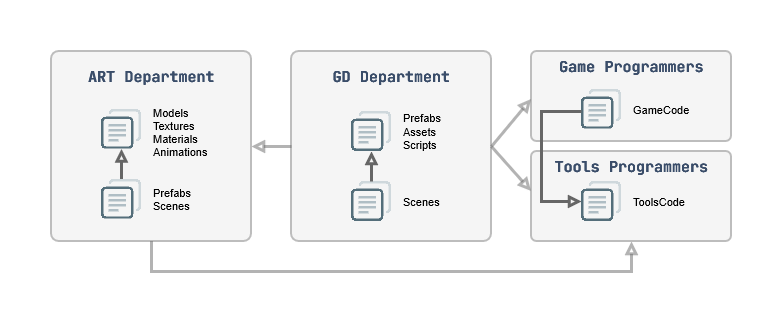

# Организация Art- и GD-данных в Unity 3D## Часть 3 из серии статей «Структурирование игрового проекта»

Валерия Пудова (hww)

💬 Telegram: @core_systems_eng

✉️ Email: <valery.hww@gmail.com>

📅 22.10.2022


------------------------------
📌 Содержание (Нажмите для перехода)

Введение
Имена папок по аспектам
Особенности аспекта Type
Визуальный контент в проекте

Структура папки External
Структура папки Internal

Визуальный контент в сцене
Игровой контент в проекте
Игровой контент в сцене

Различные аспекты игровых объектов
Структура игровых данных в сцене

Композиция префабов
Инструменты разработки (Tools)
Результат
Выводы
Ссылки на источники

------------------------------

## Введение

В работе над большим игровым проектом необходимо структурировать самые разные данные. Эта работа осуществляется каждым департаментом в отдельности, но необходимы и общие сквозные правила для всей студии.
Невозможно разработать универсальную спецификацию структуры, которая идеально подойдет под требования абсолютно любого проекта, но базовые принципы продуманного подхода можно адаптировать под любые задачи.
В этом документе описаны методы структурирования данных департаментов Art (художники) и GD (геймдизайнеры). Материал разделен на пять логических блоков:

* **Визуальный контент в проекте** — структура файлов Art-департамента.
* **Визуальный контент в сцене** — организация иерархии сцен Art-департамента.
* **Игровой контент в проекте** — структура файлов GD-департамента.
* **Игровой контент в сцене** — организация данных в геймдизайнерских сценах.
* **Инструменты разработки** — задачи автоматизации для Tools-программистов.

------------------------------

## Имена папок по аспектам

Ранее были подробно описаны различные аспекты файлов и папок [2]. Ниже приведена краткая выжимка аспектов и типовых имен по ним для быстрого проектирования структуры:

* **Team** (Департамент): Art, Design, Audio, Code, Tools.
* **Origin** (Происхождение): Internal (внутренний), External (внешний).
* **GistGroup** (Сущностная группа): Characters, Enemies, Mobs, Props, NPCs, Vehicles, Vegetation, Plants, Maps, Effects, Grounds, Roads, Sky, Terrains, Walls, Water, GUI.
* **Gist** (Индивидуальная сущность): RedCyborg, Minigun, TitleScreen.
* **Type** (Технический тип файла): Models, Materials, Textures, Animations, Terrains, Scenes, Prefabs, Particles, Shaders, Sounds.

------------------------------

## Особенности аспекта Type

Зачастую тип файла совершенно не сообщает о его фактическом наполнении. Например, файл с расширением .prefab может содержать внутри себя все что угодно: от визуального эффекта взрыва и анимированного персонажа до невидимого логического контроллера сцены. К тому же типов файлов существует слишком много, что порождает избыточную вложенность папок.

Именование каталогов по типу (Models, Textures) выглядит нецелесообразно. Если такие папки и используются, то их место исключительно на самом нижнем уровне дерева файлов. Внедрение строгой системы префиксов (описанной в Части 1) позволяет полностью отказаться от папок типов: нет никакого смысла создавать папку Textures, если имена всех текстур и так начинаются с префикса T_.

Для минимизации глубины структуры данных применяется выбор одного из двух аспектов: либо Gist, либо Type. В паттернах это отображается выражением {Gist|Type}. При необходимости его можно трактовать как подпапки {Gist}/{Type}, но гораздо важнее соблюдать выбранный подход единообразно во всем проекте

------------------------------

## Визуальный контент в проекте

Структура папок художников зависит от двух ключевых факторов:

1. Ограничения инструментов разработки (DCC), ТЗ, требования производительности и специфика архитектуры игрового движка.
2. Жизненный опыт создателя. Художник бессознательно моделирует объект так, как он устроен в реальности. Но виртуальный мир устроен иначе: чем выше реализм и детализация, тем сильнее программная структура объекта отдаляется от бытового представления.

Пример: Если ваза с цветами должна разбиваться в игре, художнику необходимо создать базовую целую модель, модель из физических осколков, настроить физические коллайдеры для каждого фрагмента и прикрепить систему частиц (Particle System) для имитации мелкой крошки.

Все эти нюансы структурируются по ходу производства, но базовым для арт-департамента является паттерн (1):

$$\text{(1)}\quad \texttt{/\{Team\}/\{Origin\}/\{GistGroup\}/\{Gist\}}\text{|}\texttt{\{Type\}/}$$

Где:

* {Team} — это название департамента — например, Art.
* {Origin} — это происхождение файлов Internal или External.
* {GistGroup} — группа объектов по сути — например, Characters.
* {Gist|Type} — название объектов или типа файлов — RedCyborg или Models

Пример реализации:

```txt
/Art/Internal/Characters/RedCyborg/
```

## Структура папки External

Если вы приобретаете сторонние ассеты и планируете обновлять их из Asset Store / OpenUPM в процессе разработки, их контент запрещено модифицировать. Они хранятся изолированно в папке External по паттерну (2):

$$\text{(2)}\quad \texttt{/\{Team\}/External/\{AssetCategory\}}\text{|}\texttt{\{Vendor\}/\{AssetName\}}$$

Классификация по категориям (AssetCategory) более интуитивна для человека. Рекомендуемые папки категорий:

`VisualScripting`, `Terrain`, `Animation`, `Utilities`, `AI`, `ParticlesAndEffects`, `Others`.

Если ассет гибридный и подходит под несколько категорий, ему волевым решением присваивается одна наиболее приоритетная.

## Структура папки Internal

Здесь находятся ассеты, создаваемые внутри студии, их структура динамична. Первый уровень иерархии папки Internal отдается под аспект GistGroup:

* Shared/ — Универсальный контент, доступный для использования в любой точке проекта (текстуры шума, градиенты, базовые примитивы мешей с кастомными UV).
* Characters/ — Основные персонажи игры.
* Enemies/ (или Mobs/) — Персонажи противников.
* Vehicles/ — Транспорт (автомобили, вертолеты, лодки).
* Weapons/ — Оружие, не привязанное к конкретному актеру жестко.
* Props/ (или Details/) — Мелкие объекты заполнения локаций.
* Vegetation/ (или Plants/) — Деревья, кусты, трава.
* Backgrounds/ — Текстуры неба, импосторы, далекие планы.
* Effects/ — Визуальные эффекты (VFX).
* Maps/ — Файлы игровых локаций.
* GUI/ — Текстуры, атласы и материалы интерфейса.
* GUIMaps/ — Сцены верстки интерфейса.

При отсутствии избытка файлов в Shared они лежат прямо в корне папки, иначе применяется паттерн (3):

$$\text{(3)}\quad \texttt{/\{Team\}/\{Origin\}/Shared/\{Gist\}}\text{|}\texttt{\{Type\}/}$$

Папка Shared может дублироваться на низких уровнях иерархии, выполняя роль локального общего хранилища для конкретной группы. С точки зрения архитектуры зависимостей, папка Maps является главным потребителем — она ссылается на все остальные папки проекта, но из них никто не должен ссылаться на папки внутри Maps.


## Папки Characters и Enemies

Если явных различий в логике между врагами и персонажами нет, объединяйте их в общую папку Characters по паттерну (4) и (5):

$$\text{(4)}\quad \texttt{/\{Team\}/\{Origin\}/Characters/\{Gist\}/}$$

$$\text{(5)}\quad \texttt{/\{Team\}/\{Origin\}/Characters/Shared/\{Gist\}}\text{|}\texttt{\{Type\}/}$$

```txt
Characters/                     -- Каталог всех персонажей
├── {c-name}/                   -- Папка конкретного персонажа (напр. RedCyborg)
└── Shared/                     -- Общие элементы
    ├── Animations/             -- Анимации, подходящие всей структуре скелетов
    └── Equipment/              -- Общие элементы экипировки
        └── {e-name}/           -- Конкретный меш экипировки (напр. Backpack)

```

### Папки Vehicles, Weapons, Props, Vegetation, Backgrounds

Необходимость таких папок обосновывается для каждого проекта в отдельности. Структура в этих папках во многом повторяет структуру папки Characters.

### Папка Effects

Вынесение VFX в отдельный каталог критически важно, если над эффектами в студии работают отдельные узкоспециализированные технические художники. Паттерн **(6)**:

$$\text{(6)}\quad \texttt{/\{Team\}/\{Origin\}/Effects/\{GistGroup\text{|}Gist\}}$$

```text
Art/Internal/Effects/Shared/              -- Базовые эффекты окружения
Art/Internal/Effects/GrenadeExplosions/   -- Эффекты взрывов гранат игрока
Art/Internal/Effects/BombExplosions/      -- Эффекты взрывов бомб противников
```

### Папка Maps

Для управления множеством игровых зон применяется паттерн **(7)**:

$$\text{(7)}\quad \texttt{/\{Team\}/\{Origin\}/Maps/\{MapName\}/\{Gist\text{|}Type\}/}$$

Внутри папки конкретной локации лежат *только те данные, которые используются исключительно на ней* (сцены, карты высот, запеченные или сгенерированные меши дорог/рек). Использование ассетов из папки конкретной карты за её пределами строго запрещено архитектурой.

Локация с именем `Shared` внутри `Maps` выступает виртуальной картой, хранящей общие для всех уровней ассеты.

 Пример одной локации ниже.

```txt
./Maps/{MapName}                 // имя локации
./Maps/{MapName}/{MapName_01}    // сцена локации, если несколько, то нумеровать 
./Maps/{MapName}/Models          // процедуральные модели этой локации ./Maps/{MapName}/Materials              // материалы этой локации
./Maps/{MapName}/Animations      // анимации для этой локации
./Maps/{MapName}/Prefabs         // префабы для этой локации
```

### Папки GUI и GUIMaps

Элементы UI оформляются как префабы (`GUI/`) или как отдельные сцены (`GUIMaps/`), структура которых полностью повторяет логику построения карт `Maps`.

### Другие аспекты: Использование Labels (Меток)

Система встроенных меток (`Labels`) в Unity — это «перпендикулярный» взгляд на файловую структуру. Списки дефолтных меток (`Architecture`, `Audio`, `Character`, `Effect`, `Ground`, `Prop`, `Road`, `Sky`, `Terrain`, `Vegetation`, `Vehicle`, `Wall`, `Water`, `Weapon`) дублируют аспект `GistGroup`. Настроенной файловой структуре метки внутри `Internal` не требуются. 

Их главная R&D-ценность — **маркировка внешнего контента (`External`)**. Поскольку структура папок сторонних плагинов хаотична, разметка каждого ключевого внешнего ресурса метками позволяет быстро находить нужные элементы через поисковую строку Unity, не перестраивая папки плагина вручную. При таком подходе утилита автоматизации должна жестко контролировать, чтобы у каждого импортированного внешнего ассета была проставлена соответствующая метка.

## Визуальный контент в сцене

Для художника сцена — это географическая модель. Здесь ключевыми становятся аспекты `Location` (сектор карты, улица), `LODLevel` (LOD0, LOD1 для оптимизации) и `Domain` (целевое рантайм-назначение).

Поиск объектов в иерархии (`Hierarchy`) упрощается за счет создания пустых (dummy) корневых объектов-контейнеров с ярким форматированием. Редактор Unity использует шрифты низкого качества, поэтому для надежного визуального выделения категорий на любых экранах лучше всего себя показал префикс и суффикс из двойного дефиса `"──"`:

```text
──StaticGeometry──       -- Статический батчащийся меш локации
──DynamicGeometry──      -- Разрушаемые и интерактивные объекты
──Colliders──            -- Невидимая упрощенная физическая модель коллизий
──Lights──               -- Источники света и пробы освещения
──Cameras──              -- Камеры и триггеры зон CineMachine
```

Иерархия объектов внутри сцены организуется по паттерну **(8)**:

$$\text{(8)}\quad \texttt{/\{Domain\}/\{Location\}/\{Gist\text{|}Prefab\}/\{LODLevel\}/}$$

Главное требование — сам корневой префаб обязан находиться на фиксированном, легко предсказуемом уровне вложенности сцены, какой бы сложной ни была структура его внутренних дочерних подобъектов.

> **Ограничение слоев и тегов:** Система тегов (`Tags`) оправдана только тогда, когда объекту нужен строго один уникальный маркер, а их общее число в проекте жестко лимитировано. Иконки (`Gizmos`) эффективнее назначать через исходный код типов ПО, а не вручную. Слои (`Layers`) зарезервированы под физику (`Matrix`) и пайплайны рендеринга (Culling Masks), использовать их для логического структурирования сцены запрещено.

## Игровой контент в проекте

Для геймдизайнера (GD) структура файлов аналогична художественной, но осложняется тем, что типы файлов скрывают суть (внутри `.asset` или `.prefab` может находиться любая конфигурация систем). Здесь критически важно повсеместное использование префиксов и суффиксов.

Главная цель — **полное разделение областей ответственности**. Изменения, вносимые дизайнерами в логику, не должны затрагивать файлы художников, и наоборот. Художники создают префабы с формой и визуалом объектов, а дизайнеры оборачивают их в префаб-варианты (`Prefab Variants`), навешивая компоненты рантайм-поведения.



Файлы геймдизайнеров организуются по паттерну **(9)**, где аспект происходождения `Origin` полностью исключен (все данные GD по определению уникальны для данной игры):

$$\text{(9)}\quad \texttt{/\{Team\}/\{GistGroup\}/\{Gist\}/}$$

## Именование префабов

Лучше если префабы, установленные в сцене сохранят свое первоначальное имя в файловой системе, к которому можно добавить нумерованный суффикс (пример ниже).

```txt
P_NPC_RedDrone_01
P_NPC_RedDrone_02
P_NPC_RedDrone_03
```

Поэтому имя префаба должно максимально точно описывать его тип, назначение, сущность и версию.

## Игровой контент в сцене

Сцена геймдизайнера — это отдельный логический слой карты локации, существующий параллельно с визуальным слоем художников. В ней полностью отсутствует видимый контент, а вся работа идет с collision/navigation геометрией, зонами триггеров, точками спавна и путями патрулирования. Видимость этих данных в Редакторе эмулируется кастомными скриптами отрисовки `Gizmos`.

Разделение визуальной и логической составляющих на отдельные файлы сцен решает проблему совместной работы и позволяет процедурным генераторам автоматически обновлять навигационные сетки (NavMesh) при изменении геометрии художниками (диаграмма 3).


**Диаграмма 3. Условные составные части игровой карты**

Таким образом каждый слой представляет определенный вид данных:

1. Визуальная модель мира
2. Физическая модель мира
3. Игровые данные необходимые для функционирования кода игры

В реальных проектах все может быть намного сложнее и слоев будет больше. Могут появиться процедуральные слои, которые могут содержать как игровые данные, так и оптимизированную версию визуальной или физической модели мира. 

Данные, которые редактируют дизайнеры отличаются тем, что у них нет видимой составляющей. Результат их работы можно увидеть только когда игра будет запущена, и этот результат не обязательно будет виден игроку — возможно он влияет на логику принятия решений и поведение персонажей. Поэтому видимость игровых данных имитируется с помощью визуальных декораторов Gizmos.

Разделение различных данных на отдельные файлы, решает множество проблем в процессе разработки игры. Процедурные генераторы игровых данных сканирует одни слои и автоматически создают или обновляют другие. Таким образом, изменение визуального контента может автоматически произвести обновлений других слоев. Например, перемещение видимого объекта сцены может обновить навигационную модель мира.

### Различные аспекты игровых объектов

В логической сцене декорации выносятся за скобки (воспринимаются как единый монолитный меш коллизии). Игровые сущности группируются по следующим аспектным направлениям:

* **Gist - Точная суть прототипа объекта.
* `Location / Zone` — Привязка к конкретной триггерной или пространственной игровой зоне.
* **Category** (Категория по рантайм-назначению)
  * `Gameplay` — Интеракции, квесты, продвижение по сюжету.
  * `Combat` — Объекты боевых систем, зоны арен.
  * `Camera` — Управление поведением камер.
  * `Sound` — Логические зоны запуска эмбиента и звуков.
  * `Dialogue` — Триггеры и точки инициации систем диалогов.
  * `Particles` — Логический запуск игровых систем частиц.
  * `Visibility` — Зоны стриминга и Occlusion Culling.
  * `Global` — Менеджеры и контроллеры, не вошедшие в другие группы.
* **Subcategory** (Подкатегория по функции объекта)
  * `Actor Spawner` — Точки генерации сущностей.
  * `Background Actors` — Контроллеры фоновой симуляции жизни.
  * `Regions` — Триггерные объемы со специфическими законами физики/геймплея.
  * `Spline` — Направляющие кривые для движения или анимации.
  * `Traversal` — Объекты паркура, лестницы, маркеры для прыжков ИИ.
  * `NavShapes` — Ограничители зон перемещения (NavMesh Obstacles).
  * `Feature Overlays` — Конфигурационные ноды вспомогательных систем.
* **Sets** (Наборы для быстрой фильтрации) Создаваемые дизайнером кастомные группы для групповых операций на конкретном уровне (например, `Teleports`, `Scriptable`, `Default`).

### Структура игровых данных в сцене

Поскольку в иерархии Unity нет папок, роль контейнеров выполняют пустые GameObject, имеющие свои координаты `Transform`. Использование пространственных игровых зон — самый эффективный метод группировки логики. Паттерн **(10)**:

$$\text{(10)}\quad \texttt{/\{Location\text{|}Zone\}/\{Gist\text{|}Prefab\}}$$

Пример реализации:

```txt
FactoryGates_Zone_01/                         -- Корневой объект зоны ворот фабрики
├── P_RedCyborgSpawner_01                     -- Спавнер первой волны врагов
├── P_RedCyborgSpawner_02                     -- Спавнер второй волны врагов
├── P_BigBossCyborgSpawner_01                 -- Точка появления босса
└── P_ControlTable_01                         -- Интерактивный пульт управления ворот
```

При необходимости, если зон планируется очень много, паттерн может быть модифицирован (11):

$$\text{(11)}\quad \texttt{/\{Location\text{|}Zone\}/\{Sublocation\text{|}Subzone\}/\{Gist\text{|}Prefab\}}$$

> Если инструменты разработки на уровне кода IDE Редактора умеют фильтровать, группировать и подсвечивать объекты по всем остальным аспектам (`Category`, `Subcategory`, `Sets`), иерархическое дерево в сцене становится избыточным. В этом случае можно полностью отказаться от вложенности GameObject, расположив все элементы плоским списком в корне сцены по паттерну *(12)*:

$$\text{(12)}\quad \texttt{/\{Gist\text{|}Prefab\}}$$

```text
FactoryGates_Zone_01              -- Изолированная нода зоны ворот
FactoryWorkshop_Zone_01           -- Нода зоны цеха
P_RedCyborgSpawner_01             -- Плоский список независимых префабов
P_RedCyborgSpawner_02             
P_ControlTable_01                 
```

Каждый установленный в сцене экземпляр префаба обязан сохранять свое исходное имя из файловой системы с добавлением уникального цифрового суффикса (P_NPC_RedDrone_01, P_NPC_RedDrone_02). Нумеровать необходимо абсолютно каждый объект.

------------------------------

## Композиция префабов

Префабы — мощный инструмент, но смешивание различных идиом их использования (linked prefabs, nested prefabs, god prefabs) мгновенно уничтожает стабильность проекта. Необходимо выбрать одну идиому для всей студии.
Иерархические префабы и префаб-варианты концептуально идентичны наследованию классов в ООП. Это хрупкая структура: неосторожное локальное изменение базового объекта может каскадно сломать логику сотен дочерних вариантов по всему проекту. Чтобы не допустить деградации структуры данных, внедрите правила:

1. По возможности избегайте глубокого наследования префабов. Зачастую надежнее и проще иметь два независимых префаба, чем сложный граф зависимостей.
2. Жесткий лимит вложенности вариантов — не более двух уровней иерархии. Базовый префаб содержит костяк и логику актера, а дочерний вариант — лишь подменяет визуальный материал или добавляет обвес.
3. Запрещено модифицировать префаб внутри его внутренней иерархии. Все параметры кастомизации выносятся на самый верхний корневой уровень префаба и управляются через единый интерфейс одного скрипта-компонента (например, DroneSettings).

Паттерн для вложенных префабов (13):

$$\text{(13)}\quad \texttt{/{Location\text{|}Zone}/{Gist\text{|}Prefab}/{GistGroup}/{Gist}}$$

На примере ниже в качестве GistGroup используется слово Equipment:

```txt
// Верхний уровень префаба RedDrone
//   В компоненте DroneSettings содержатся параметры кастомизации:
//   - Для экземпляра дрона 
//   - Для аксессуаров дрона, например, Minigun
P_Enemy_RedDrone_01
P_Enemy_RedDrone_01/Model
P_Enemy_RedDrone_01/Controller
P_Enemy_RedDrone_01/Representation
// Дочерний префаб Minigun без модификаций.
P_Enemy_RedDrone_01/Equipment/P_Minigun
P_Enemy_RedDrone_01/Equipment/P_Minigun/Model
P_Enemy_RedDrone_01/Equipment/P_Minigun/Controller
P_Enemy_RedDrone_01/Equipment/P_Minigun/Representation
```

------------------------------

## Инструменты разработки (Tools)


Проектирование кастомного инструментария силами Tools-программистов и CTO — это единственный способ создать сложный коммерческий продукт с минимальными затратами, кратно повысив производительность труда дизайнеров и художников.

## Обязательный стек внутренних инструментов студии

1. Система контроля версий и CI/CD ферма: Базовый элемент инфраструктуры. Каждый разработчик должен иметь возможность через веб-панель фермы запустить автоматическую сборку билда с интересующей его картой, собранной напрямую из локальных файлов его рабочей станции.
2. Project Management комплекс: Интегрированные системы ведения задач, баг-трекинга и сквозного документирования архитектуры.
3. Утилита управления ресурсами (Asset Renamer): Специализированный инструмент для автоматического группового переименования, перенумерации и замены префиксов/суффиксов ассетов согласно принятым конвенциям студии. Утилита должна валидировать проект и вести строгий лог-файл изменений структуры для автоматического разрешения конфликтов слияния (merge conflicts) в Git.
4. Рантайм-инструменты отладки и полировки (In-Game Tools): Системы, работающие непосредственно в запущенной игре. Они позволяют QA-инженерам и геймдизайнерам анализировать состояния систем, изменять геймплейные параметры и логировать результаты на лету, полностью исключая необходимость перезапуска или перекомпиляции проекта.

**Диаграмма 4. Инструменты отладки и полировки**


## Результат

В результате, основные паттерны именования папок представлены в таблице ниже. Остальные паттерны могут быть добавлены по мере развития вашего проекта.  

**Таблица 1** **Сводные паттерны именования каталогов и иерархий**

| Тип данных / Сфера применения | Пуленепробиваемый паттерн именования |
| :--- | :--- |
| **Внешний контент проекта** | `/{Team}/External/{AssetCategory &#124; Vendor}/` |
| **Визуальный контент проекта** | `/{Team}/Internal/{GistGroup}/{Gist &#124; Type}/` |
| **Визуальный контент сцены** | `/{Domain}/{Location}/{Gist &#124; Prefab}/{LODLevel}/` |
| **Игровой контент проекта** | `/{Team}/{GistGroup}/{Gist}/` |
| **Игровой контент сцены** | `/{Location &#124; Zone}/{Gist &#124; Prefab}/` |
| **Дочерний вложенный префаб** | `/{Location &#124; Zone}/{Gist &#124; Prefab}/{GistGroup}/{Gist &#124; Prefab}/` |


------------------------------

## Выводы

* Разделяйте структуры файлов в каталогах и структуры объектов в сценах строго по изолированным департаментам.
* Храните внешние ассеты (External) отдельно от внутренних (Internal), не изменяя их структуру, но активно размечая их метками (Labels) для сквозного поиска.
* Собирайте финальные карты локаций из нескольких независимых сцен-слоев (визуальный, физический, логический слои данных).
* Жестко ограничивайте глубину вложенности папок и иерархий GameObject в сцене. Стремитесь к плоским структурам.
* Не смешивайте идиомы использования префабов, ограничьте глубину наследования вариантов до двух уровней и управляйте кастомизацией только с верхнего корневого узла.
* Контент общих каталогов (Shared) должен быть строго ограничен по видимости и доступен для использования только на аналогичном или более низких уровнях иерархии проекта.
* Выделяйте ресурсы студии на команду Tools-программистов. API редактора Unity позволяет написать весь необходимый арсенал автоматизации и рантайм-отладки.

Совершенствование структуры проекта и развитие внутренних инструментов автоматизации — это не разовая задача, а непрерывный R&D-процесс всей инженерной команды.

------------------------------

## Ссылки на источники

* [1] 📄 Именование файлов в Unity 3D (Часть 1)
* [2] 📄 Организация файлов проекта в Unity 3D (Часть 2)
* [3] 📄 50 Tips and Best Practices for Unity by Herman Tulleken (08/12/16)
* [4] 📄 Unreal Engine Assets Naming Convention
* [5] 📄 [Unity Project Style Guide](https://github.com/timdhoffmann/unity-project-style-guide)
* [6] 📄 Unity Best Practices
* [7] 📄 Unity Manual: Special Folder Names
* [8] 📄 [Unity Manual: Script Compilation Order](https://docs.unity3d.com/Manual/ScriptCompileOrderFolders.html)
* [9] 📚 Gregory J. [Game Engine Architecture](https://www.gameenginebook.com/). – AK Peters/CRC Press, 2018.
* [10] 📄 Game Programmer from Naughty Dog Talks Uncharted 4 Production Process