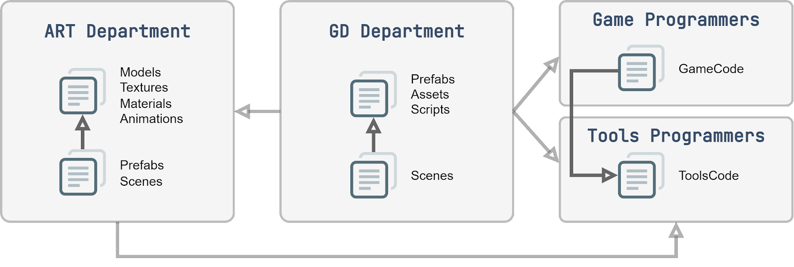

## Организация файлов проекта в Unity 3D## Часть 2 из серии статей «Структурирование игрового проекта»

Валерия Пудова (hww)

💬 Telegram: @core_systems_eng

✉️ Email: <valery.hww@gmail.com>

📅 05.10.2022


------------------------------
📌 Содержание (Нажмите для перехода)

Введение
Корневая папка проекта

Специальные папки Unity
Скрытые ассеты Unity

Аспекты файлов
Именование папок по различным аспектам файлов
Наименование папок проекта в корневом директории
Директории второго уровня
Специальные папки проекта
Содержимое папок Code и Tools

Модули
Пример модулей
Структура модуля

Выводы
Ссылки на источники

------------------------------

## Введение

Основная цель вдумчивого структурирования проекта — это упрощение рабочего процесса, а также сокращение времени погружения в работу новых сотрудников. Кроме этого, необходимо учесть рабочий процесс игровой студии и, по возможности, минимизировать взаимные коллизии, а также обеспечить разделение проекта на несколько рабочих репозиториев.

Цель данного исследования — предложить паттерны именования папок проекта, как минимум, на два уровня иерархии от корневого директория. Поэтому, в первую очередь, необходимо определить содержимое корневой папки.
Этот документ является частью серии статей на тему структурирования игрового проекта. Первая статья из серии — «Именование файлов в Unity 3D» — посвящается техникам именования файлов

------------------------------

## Корневая папка проекта

Корневая папка, в которой расположен игровой проект, также используется для специальных папок Unity. Кроме этого, она используется для папок некоторых сторонних пакетов. Все это приводит к тому, что в корневой папке будет контент, не подлежащий структурированию. Поэтому лучшей стратегией будет не создавать слишком много элементов в корневой папке проекта.
Ниже перечислены специальные папки Unity и их особенности.

## Специальные папки Unity

Они имеют ряд имен, которые Unity интерпретирует особенным образом, поэтому с содержимым такой папки следует обращаться особым образом. Например, чтобы исходный код инструментов редактора работал правильно, его нужно поместить в папку с названием Editor.
Существуют три основные разновидности специальных папок:

   1. **Absolute** — папка должна быть единственной, она расположена в корневой папке проекта. В этом случае внутри нее стоит помещать папку с именем модуля, для которого предназначены файлы в ней. Эта разновидность папок Unity является ограничением.
   2. **Relative** — папка может находиться в любом месте дерева. В этом случае файлы можно помещать непосредственно в нее, но при этом лучше не использовать эту папку в корневом директории.
   3. **Relative Merged** — папка может находиться в любом месте дерева, но будет конкатенированной в билде. В этом случае внутри нее стоит помещать папку с именем модуля, для которого предназначены файлы в ней. Однако при этом лучше не использовать эту папку в корневом директории.

Ниже приведен полный список специальных имен папок, используемых Unity:

### Assets

Корневая папка проекта. Главная папка, в которой содержатся все ассеты, которые могут быть использованы проектом Unity.

### Editor (Relative)

Папка для расширения редактора может быть помещена в любое место структуры.

### Editor Default Resources (Absolute)

Папка ресурсов редактора, предоставляемых по требованию методом EditorGUIUtility.Load. Папка находится в корневом директории.

### Gizmos (Absolute)

Пользовательские gizmos редактора находятся в корневом директории проекта.

### Plugins (Absolute)

Многие сторонние пакеты Unity будут устанавливаться именно в эту папку. Содержимое этой папки компилируется до остальных файлов, что может быть использовано для разбиения проекта на модули [6].

### Resources (Relative Merged)

Файлы, расположенные в папке Resources, будут доступны для загрузки в рантайме. Возможность помещать эту папку в любом месте проекта — это очень ценное свойство.

### Standard Assets и Pro Standard Assets (Absolute)

Эти папки используются для некоторых пакетов Unity.

### StreamingAssets (Absolute)

Используется для файлов, загружаемых или сохраняемых в рантайме. Папка находится в корневом директории.

## Скрытые ассеты Unity

Редактор Unity полностью игнорирует файлы и папки, которые:

* Имеют имя "cvs"
* Начинаются с символа "."
* Заканчиваются символом "~"
* Имеют расширение ".tmp"

------------------------------

## Аспекты файлов

В интернете очень много различных рекомендаций и соглашений по структурированию проекта [1],[2],[3],[4]. Безусловно, все это очень полезная информация, но для принятия решений лучше самостоятельно проанализировать ваш проект и структурировать его. И лучше всего начать с классификации файлов по их аспектам.
Любой файл проекта может иметь множество аспектов и поэтому теоретически может быть расположен в различных местах. Объединять файлы в папки можно по одному из аспектов файла. Ниже перечислены некоторые из возможных аспектов:

### По содержимому файла (Gist)

Чем фактически является объект внутри файла: TinyHouse, LargeTower.

### Группы по содержимому файла (Gist Group)

Группа, в которую входит объект файла: Maps, Characters, Vehicles, Weapons, Effects, Terrain, Background, Props, Vegetation, Details.
В некоторых студиях над такими группами работают разные команды, поэтому такие папки позволяют разделить области ответственности и минимизировать взаимные коллизии.

### Тип файла (Type)

По типу файлов — без интерпретации содержимого. Например: Models, Textures, Materials, Particles, Prefabs, Scenes.
Часто тип файла совершенно не сообщает о содержимом. Например, в префабе может быть все что угодно. К тому же существует слишком много различных типов. Поэтому именование папок по типу выглядит нецелесообразно. И если такие имена использовать, то в самом низу иерархии дерева файлов.

### Группа типов файлов (Team)

Без оценки содержимого некоторые типы файлов можно собрать в более крупные группы. Часто над такими группами работает отдельная команда проекта. В качестве примера можно привести следующие названия групп:

* Art — визуальный контент арт-департамента.
* Design — префабы и ассеты, созданные дизайнерами.
* Audio — звуковые музыкальные файлы, префабы, настройки миксера.
* Code — файлы исходного кода игры.
* Tools — файлы исходного кода инструментов художника.

В названии группы не должны быть использованы названия типов. В примере выше группа, в которой вероятно находятся различные системы частиц, именуется Audio вместо Sounds, так как в папке, кроме звуковых файлов, могут находиться и другие объекты: настройки миксера, префабы и ассеты объектов сцены.
Если необходимо, чтобы эти папки располагались рядом, можно добавить префикс: GameArt, GameDesign, GameAudio, GameCode.

### Происхождение файла (Origin)

Файлы большого проекта могут иметь разное происхождение, но чаще всего эти файлы были созданы внутри студии или приобретены — то есть внутренние (Internal) или внешние (External).
Внешние модули или ассеты не должны сильно модифицироваться, так как должны оставаться легко обновляемыми до новой версии. В случае если студия вносит значительные изменения во внешние файлы, то необходимо одно из двух:

1. Предложить эти изменения автору и оставить модуль внешним.
2. Реструктурировать модуль во внутренний.

* Другие аспекты
Их много. В качестве примера: аспект процедурной генерации файлов может позволить обобщить такие файлы в папке Procedural, а их исходные шаблоны — в папке Templates.

------------------------------

## Именование папок по различным аспектам файлов

Разделение файлов по аспекту Team положительно влияет на работу студии. В результате можно структурировать проект так, чтобы изменения файлов и структуры папок вносили лишь их создатели (рисунок 1). Для достижения этого в Unity есть несколько инструментов: аддитивно загружаемые сцены, иерархические префабы, префаб-варианты и другие.


Рисунок 1. Зависимости между и внутри департаментов

В результате предложенного варианта зависимостей можно считать верными следующие утверждения:

1. Tools Programmers — работают только со своим контентом.
2. Game Programmers — работают со своим контентом и Tools-контентом.
3. Art Department — работает со своим контентом и Tools-контентом.
4. Игровым дизайнерам требуется самый большой объем файлов:

   * На этапе pre-production необходимы файлы Game Code и Tools.
   * На этапе production требуются все файлы проекта.

Очень важно отделить код инструментов (ToolsCode) от кода игры (GameCode) так, чтобы первый не зависел от второго (рисунок 1). Это позволит минимизировать необходимость внесения изменений в Art-департаменте по мере разработки кода игры.
Учитывая высокую важность аспектов Team и Origin, сквозной шаблон именования папок может выглядеть так:

$$\text{(1)}\quad \texttt{\{Team\}/\{Origin\}/\{GistGroup\}/\{Gist\}/\{Type\}/}$$

Примеры путей:

```txt
/Art/External/Explosions/GrenadeExplosions/Prefabs/SmallGrenadeExplosion
/Art/External/Explosions/GrenadeExplosions/Textures/BlackSmoke.tga
```

------------------------------

## Оптимизация глубины иерархии

Однако желательно избегать слишком глубокой вложенности. Человек легко ориентируется в файловой системе не более чем в трех уровнях иерархии. Можно считать, что запоминаемая сигнатура положения файла состоит из первых трех элементов пути. Желательно, чтобы на этом уровне дизайнер мог найти искомый элемент.
При этом, чем меньше папок в корневом директории, тем глубже может быть иерархия проекта. Если папка верхнего уровня всего одна, её можно мысленно игнорировать — так же, как мы игнорируем системную папку Assets.
Для минимизации глубины иерархии можно использовать усеченный фрагмент предыдущего паттерна:

$$\text{(2)}\quad \texttt{\{Team\}/\{Origin\}/\{GistGroup\}/\{Gist\text{|}Type\}/}$$


Примеры путей с использованием Gist:

```txt
/Art/Internal/Architecture/LargeTower/LargeTower.mb
/Art/Internal/Architecture/LargeTower/LargeTower.tga
/Art/Internal/Architecture/TinyHouse/TinyHouse.mb
/Art/Internal/Architecture/TinyHouse/TinyHouse.tga
```

Примеры путей с использованием Type:

```txt
/Art/Internal/LensFlares/Textures/LensFlares_01.tga
/Art/Internal/LensFlares/Models/LensFlares_01.mb
```

Для геймдизайнеров аспект Origin чаще всего избыточен, так как все файлы дизайна проходят адаптацию и внутренний рефакторинг. Поэтому для них паттерн сокращается до:

$$\text{(3)}\quad \texttt{\{Team\}/\{GistGroup\}/\{Gist\text{|}Type\}/}$$

Примеры путей:

```txt
/Design/Actors/Cyborg/RedCyborg.prefab
/Design/Actors/Cyborg/GreenCyborg.prefab
```

------------------------------

## Наименование папок проекта в корневом директории

В корневую папку Assets следует помещать папки с наиболее обобщенным названием по департаментам:

* Art — для художников.
* Design — для игровых дизайнеров.
* Audio — для звукорежиссеров.
* Code — для game-программистов.
* Tools — для tools-программистов.

Инженерный совет: Если вы хотите, чтобы ваши кастомные папки проекта были четко сгруппированы и отделены от папок сторонних плагинов, добавьте им в качестве префикса короткую аббревиатуру проекта или компании (например, /Prj_Art/, /Prj_Code/).

------------------------------

## Директории второго уровня

На втором уровне можно дать разработчикам отделов свободу структурирования, но спецификация базовых правил упрощает кросс-департаментное взаимодействие. Здесь ключевым становится аспект происхождение файла (Origin).

## Internal

Папка для пакетов и систем, разработанных внутри студии. Каждый пакет структурирован согласно соглашению, описанному в разделе Структура модуля. Пакет может подключаться и использоваться в проекте как изолированный git submodule.

## External

Внешние плагины и ассеты (OpenVR, HTC, Steam, Photon, Emerald и т.д.). Особенность папки в том, что пакеты в ней хранятся строго в том виде, в котором они были приобретены. Как только студия начинает интенсивно модифицировать содержимое внешнего пакета, его разумнее перенести в папку Internal.
Папка External не должна содержать хаотичный список элементов, её структура организуется по строгому паттерну:

$$\text{(4)}\quad \texttt{External/\{Vendor\text{|}Category\}/\{PackageName\}}$$

Внутри папки используется одно из двух разделений:

* Vendor — Имя компании-производителя пакета.
* Category — Категория пакета (согласно классификации Asset Store или OpenUPM).

Примеры популярных категорий: `VisualScripting`, `Terrain`, `Animation`, `Utilities`, `AI`, `ParticlesAndEffects`, `Others`.

------------------------------

## Специальные папки проекта

Предназначены для особых случаев и могут быть внедрены в любом месте иерархии для повышения понимаемости структуры:

### Scenes

Размещаются любые сцены, необходимые для конкретного модуля. Это Type-аспект.

### Maps

Сцены с финальными игровыми локациями. Обычно распределяются по папкам департаментов, чтобы каждый отдел работал со своим списком карт.
Пример: /Design/Maps/FishingVillage.unity

### Examples

Любые файлы и сцены, необходимые исключительно для демонстрации примеров работы. При сборке через CI/CD данные папки могут быть полностью проигнорированы и исключены из финального билда.

### Ignore

Папка, которая полностью игнорируется системой контроля версий (через правила в .gitignore), но подхватывается редактором Unity. Любой сотрудник может создать её локально в любом месте в качестве персональной «песочницы» для экспериментов.

### Experimental

Экспериментальные файлы, используемые на этапе активного R&D. Модули в этой папке располагаются по паттерну:

$$\text{(5)}\quad \texttt{Experimental/\{ModuleName\}\text{.}\{SubmoduleName\}}$$

По окончании исследований файлы реструктурируются и переносятся в Internal, либо безвозвратно удаляются.

### Procedural

Для файлов, автоматически создаваемых инструментами процедурной генерации. Они должны быть аппаратно защищены от ручного редактирования пользователем, так как перезаписываются генератором.

### Templates

Для исходных шаблонов и конфигураций процедурного генератора.

### Sources

Исходные файлы рабочих инструментов разработки (Content Creation Tools, такие как исходники .max, .blend, .psd). Их правильнее хранить вне папки проекта игры. Но если вы всё же храните их внутри репозитория, помещайте их в папку Sources, чтобы автоматика CI/CD гарантированно исключала их из билда.

------------------------------

## Содержимое папок Code и Tools

Данные директории предназначены для инженеров, поэтому контент в них организован в виде функциональных модулей. При этом внутри изолированного модуля программиста могут находиться и сопутствующие ресурсы (шрифты, текстуры, тестовые сцены), необходимые для его автономной работоспособности.
Базовые поддиректории:

* Internal — для внутренних модулей.
* External — для сторонних библиотек и модулей.
* Scenes — общие отладочные сцены программистов.

## Модули

Внутриигровую архитектуру необходимо строго разделять на модули. Модуль — это определенный функциональный фрагмент игры или обособленный фреймворк, оформленный в виде отдельной папки. Внутри папки модуля действует большинство правил, справедливых для корневой папки проекта.
Такая структура позволяет при первой необходимости безболезненно превратить модуль в изолированный UPM-пакет (Unity Package Manager) для сквозного распространения через корпоративный реестр пакетов.
Паттерн именования папок модулей разработки:

$$\text{(6)}\quad \texttt{/Assets/Dev/Internal/\{ModuleName\}.\{SubmoduleName\}/}$$

## Пример модулей

Ниже показана структура на примере интеграции двух систем — основного игрового модуля Game и модуля искусственного интеллекта AI:

```txt
Code/                              -- Корневой каталог программистов
├── External/                      -- Модули сторонней разработки
└── Internal/                      -- Модули собственной разработки
    ├── Game/                      -- Основной архитектурный модуль игры
    ├── Game.Audio/                -- Звуковой субмодуль игры
    ├── AI/                        -- Базовый AI-модуль игры
    ├── AI.Crowd/                  -- Субмодуль симуляции толпы
    ├── AI.Melee/                  -- Субмодуль ближнего боя
    └── AI.PathFinding/            -- Субмодуль поиска путей
```

------------------------------

## Структура модуля

По своему назначению и типу дистрибуции модули разделяются на два типа: внутриигровые модули (In Game Module — IGM) и внешние разделяемые пакеты (Unity Package Manager — UPM).

## 1. IGM-модуль

Используется локально для игровой логики или кастомных инструментов редактора. Архитектура его папки выглядит так:

```txt
%ModuleName%/
├── README.md                      -- Документация и спецификация модуля
├── Scripts/                       -- Исходный код системы (C#)
├── Editor/                        -- Скрипты расширения редактора Unity
├── Prefabs/                       -- Префабы, используемые и генерируемые модулем
├── Art/                           -- Визуальный контент (меши, текстуры) модуля
├── Audio/                         -- Звуковое сопровождение модуля
├── Scenes/                        -- Тестовые и отладочные сцены модуля
├── Examples/                      -- Примеры использования для интеграторов
│   └── Example_01/                -- Изолированный кейс использования
└── Resources/
    └── %ModuleName%/              -- Ресурсы, загружаемые через Resources.Load()
```

Критически важное правило: Во избежание конфликтов имен при слиянии билда, внутри папки Resources всегда необходимо создавать подпапку с уникальным именем самого модуля!

## 2. UPM-модуль

Чтобы быстро преобразовать локальный IGM-модуль в полноценный независимый UPM-пакет, необходимо выполнить три шага:

   1. Добавить в корень папки конфигурационный файл package.json, содержащий метаданные проекта, версию и зависимости.
   2. Переименовать папку Examples в Examples~. Символ тильды скроет папку от автоматического импорта движком, что позволит разработчикам загружать примеры опционально по своему требованию прямо через стандартный интерфейс Package Manager.
   3. Добавить файлы юридической лицензии LICENSE и версионирования CHANGELOG.md для корректной работы систем автоматического деплоя (CI/CD).

------------------------------

## Выводы

Игровой студии необходимо непрерывно развивать и поддерживать систему организации проектов и правил именования файлов и папок с учетом масштабирования команды и усложнения процессов. Привести большой проект к стройной, интуитивно понятной системе — сложная задача. Чем больше команда, тем выше цена ошибки, а случайное хаотичное структурирование файлов усложняет разработку многократно.

На основе разнородных индустриальных источников и личного R&D-опыта управления кодовой базой, в этом документе я сформулировала последовательный подход к структурированию проекта, который доказал свою эффективность на практике.

В следующей статье цикла будут детально рассмотрены частные вопросы организации структуры и рабочих пространств по конкретным департаментам студии (Art, Design, Audio)

------------------------------

## Ссылки на источники

* 📄 **[1]** [50 Tips and Best Practices for Unity by Herman Tulleken (08/12/16)](http://www.gamasutra.com/blogs/HermanTulleken/20160812/279100/50_Tips_and_Best_Practices_for_Unity_2016_Edition.php)
* 📄 **[2]** [Unreal Engine Assets Naming Convention](https://wiki.unrealengine.com/Assets_Naming_Convention)
* 📄 **[3]** [Unity Project Style Guide](https://github.com/timdhoffmann/unity-project-style-guide)
* 📄 **[4]** [Unity Best Practices](http://www.glenstevens.ca/unity3d-best-practices/)
* 📄 **[5]** [Unity Manual: Special Folder Names](https://docs.unity.cn/ru/2021.1/Manual/SpecialFolders.html)
* 📄 **[6]** [Unity Manual: Special Folders and Script Compilation Order](https://dev.rbcafe.com/unity/unity-5.3.3/en/Manual/ScriptCompileOrderFolders.html)
* 📚 **[7]** Gregory J. [Game Engine Architecture](https://www.gameenginebook.com/). – 3rd Edition, Adventure in Grand Software, AK Peters/CRC Press, 2018.
