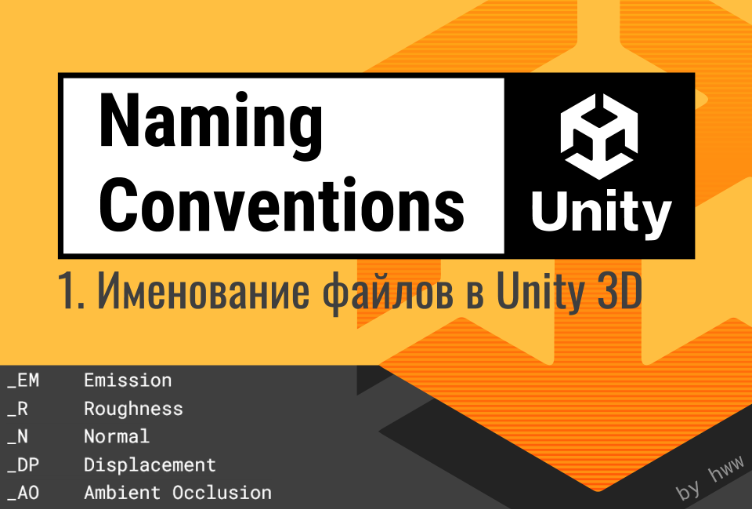

# Именование файлов в Unity 3D## Часть 1 из серии статей «Структурирование игрового проекта»

Валерия Пудова (hww)

💬 Telegram: @core_systems_eng

✉️ Email: <valery.hww@gmail.com>

📅 22.09.2022

------------------------------
📌 Содержание (Нажмите для перехода)

Введение
Префикс имени файла

Префикс по типу файла (Type)
Префикс по назначению файла (Target)
Префикс для сортировки файлов (Sequence)
Префикс для временных файлов (Temp)

Суффикс имени файла

Суффикс по назначению файла (Target)
Суффикс для версии файла (Version)
Суффикс для сортировки файлов (Sequence)
Суффикс для подвида файла (Aspect)
Суффикс по содержанию файла (Content)

Комбинирование суффиксов
Зарезервированные правила Unity
Правила именования
Выводы
Ссылки на источники

------------------------------

## Введение

Именование файлов исходного кода подробно описано в официальном документе Microsoft Coding Conventions C#, в то время как в данном исследовании предлагается рассмотреть эффективные варианты именования файлов для медиаконтента (ассетов).
Существует два фундаментальных стиля именования файлов (таблица 1). Необходимо выбрать один из них в самом начале R&D-этапа и строго следовать ему от начала и до релиза проекта.

### Два основных стиля именования файлов**

#### 1 `PascalCase`

Записывать слова без пробелов, выделяя каждое новое слово заглавной буквой. Для логического разделения контекста допускается символ подчеркивания:

* `MagneticRifle`
* `MagneticRifle_Broken`

Префиксы и суффиксы пишутся исключительно капсом:

* `SM_RailwayStation`
* `RailwayStation_EM`

#### 2 `lower-case`

Использовать символы исключительно нижнего регистра для имен, префиксов и суффиксов. Вместо пробелов применяется знак подчеркивания:

* `magnetic_rifle`
* `sm_railway_station`
* `railway_station_em`

Альтернативно допускается использование дефиса (kebab-case):

* `magnetic-rifle`

### Сравнение

Вариант PascalCase является наиболее распространенным среди Unity-разработчиков, поскольку он органично вытекает из конвенций написания кода на C#. Вариант с использованием lower-case может стать приоритетным, если в студии развернута кастомная низкоуровневая система управления и стриминга ассетов — это гарантированно предотвратит любые баги, связанные с чувствительностью серверных ОС (Linux) к регистру ввода.

В обоих случаях в именах файлов разрешено использовать только латинский алфавит, цифры и некоторые спецсимволы. Помимо подчеркивания и дефиса, в Unity зарезервирован символ `@` для связывания анимационных файлов с трехмерными мешами.

Важное правило: Никогда не применяйте выбранный внутренний стиль к файлам сторонних плагинов (из Asset Store). Оставляйте их структуру оригинальной, внося лишь косметические правки при критической необходимости. Это сэкономит массу времени при плановом обновлении пакетов до новых версий.

Использование пробелов в путях файлов запрещено, так как ведет к трудноуловимым системным ошибкам.

------------------------------

## Префикс имени файла

Использование специальных префиксов влияет на физическую сортировку файлов в каталогах: все файлы с одинаковым префиксом всегда группируются рядом. Это самый ценный результат инструмента. Однако префиксы могут усложнять чтение имени, поэтому применять их нужно системно и во всех файлах категории без исключений, чтобы команда привыкла к паттерну.

## Префикс по типу файла (Type)

Внутри самой Unity префикс типа не несет практической пользы, но он незаменим при анализе репозитория через внешние утилиты VCS (Git) или файловый менеджер ОС.
Рекомендуемый стандарт сокращений:

* `SM_` — Static Mesh (Статический меш)
* `SK_` — Skeletal Mesh (Скелетал меш)
* `P_` — Prefab (Префаб)
* `PS_` — Particle System (Система частиц)
* `M_` — Material (Материал)
* `PM_` — Physical Material (Физический материал)
* `T_` — Texture (Текстура)
* `A_` — Audio Clip (Аудиоклип)
* `AM_` — Audio Mixer (Аудиомикшер)
* `S_` — Scene (Игровая сцена)
* `SP_` — Sprite (Спрайт)
* `F_` — Font (Шрифт)
* `SH_` — Shader (Шейдер)

## Префикс по назначению файла (Target)

Используется для ассетов и префабов, чтобы явно указать контекст их рантайм-поведения. Например, при структурировании сцен:

* `SC_FishingVillage` — Главная базовая сцена, которую можно запустить автономно.
* `SA_FishingVillage` — Сцена, предназначенная строго для аддитивной загрузки (LoadSceneMode.Additive).
* `TST_FishingVillage` — Изолированная тестовая сцена программистов.
* `TSA_FishingVillage` — Тестовая сцена для аддитивной проверки подсистем.

## Префикс для сортировки файлов (Sequence)

Цифровой префикс необходим для упорядочивания объектов с разными именами в четкую очередь исполнения. Это критично при хранении звуковых файлов диалогов, где реплики персонажей должны идти друг за другом. Обязательно используйте незначащие нули на конце (обычно двузначный индекс):

* `01_BootScene`
* `02_SandyBeachScene`
* `03_OldFactoryScene`

Учитывая специфику Sequence-префикса, не используйте совместно с ним другие префиксы, чтобы не перегружать строку.

## Префикс для временных файлов (Temp)

Любые временные файлы или папки-песочницы помечаются двойным подчеркиванием (или двойным дефисом в lower-case стиле) в самом начале имени. Двойной символ позволяет мгновенно отфильтровать их через глобальный поиск для массовой очистки проекта перед релизом:

* `__RailwayStationScene`

------------------------------

## Суффикс имени файла

Суффикс добавляет метаинформацию об объекте, практически не нарушая базовую алфавитную сортировку файлов, что делает его крайне удобным инструментом.

## Суффикс по назначению файла (Target)

Указывает на специфику применения ресурса рантайм-системами:

* `BootScene_1P` — Конфигурация для однопользовательского режима (Singleplayer).
* `BootScene_2P` — Конфигурация для локального мультиплеера на одном экране.
* `BootScene_ADD` — Дополнительный аддитивный контент сцены.

## Суффикс для версии файла (Version)

Несмотря на то, что версионирование — это задача Git, ручное версионирование суффиксами незаменимо, когда художнику или дизайнеру необходимо прямо в одной сцене визуально сравнить несколько итераций объекта. Используйте строгий цифровой шаг с незначащими нулями:

* `RedStone_V01`
* `RedStone_V02`

Правило: Никогда не пишите в имени слова вроде StoneFinal, StoneVersion2 или StoneBetter. В геймдеве невозможно предугадать, какая версия станет финальной, поэтому используйте исключительно цифровые индексы.

## Суффикс для сортировки файлов (Sequence)

Применяется для создания массивов мелких вариаций одного и того же ассета (актуально для текстур поверхностей и деталей окружения) [0:1.26, 0:1.27]. Индексацию строго рекомендуется начинать с нуля (_00), чтобы имя ассета в каталоге идеально совпадало с его программным индексом в массиве данных кода:

* `RedStone_00` (Вариант 0)
* `RedStone_01` (Вариант 1)

## Суффикс для подвида файла (Aspect)

Используется вместо цифр, когда у объекта есть четкие логические или физические состояния:

* Состояния интерфейса: EnterButton_Active, EnterButton_Inactive.
* Стороны скайбокса: JungleSky_Top, JungleSky_North.
* Уровни детализации мешей: RedCyborg_LOD0, RedCyborg_LOD1.

## Суффикс по содержанию файла (Content)

Чаще всего применяется в пайплайне технического арта и текстурирования для явного указания карт материалов:

* _RGB /_BC — Albedo / Base Color (Диффузный цвет)
* _A — Opacity / Alpha (Карта прозрачности)
* _BC_A — Комбинированная карта: Albedo + Alpha
* _R — Roughness / Smoothness (Шероховатость поверхности)
* _MT — Metallic (Карта металличности)
* _MT_R — Комбинированная карта: Metallic + Roughness
* _N — Normal Map (Карта нормалей)
* _DP /_H — Displacement / Height Map (Карта высот)
* _AO — Ambient Occlusion (Карта затенения)
* _FM — Flow Map (Карта направления потоков жидких сред)
* _M — Mask (Универсальная маска для шейдеров)

------------------------------

## Комбинирование суффиксов

Суффикс контента (Content) имеет наивысший приоритет информативности и обязан всегда находиться в самом конце имени файла. Порядковые индексы и версии располагаются перед ним.
Строгая сквозная формула сборки полного имени выглядит так:

$$\text{(1)}\quad \texttt{[prefix][name][aspect][sequence\text{|}target][version][content]}$$

Примеры правильного комбинирования:

* `Grass_00_V01_RGB` (Вариант 0, итерация 1, карта цвета)
* `Grass_00_V01_A` (Вариант 0, итерация 1, карта прозрачности)
* `Sky_North_V01_RGB` (Северная сторона неба, итерация 1, цвет)

Не используйте более трех суффиксов одновременно, иначе имя превратится в нечитаемую строку

------------------------------

## Зарезервированные правила Unity

Редактор Unity на аппаратном уровне рантайма полностью игнорирует и не импортирует в проект файлы и папки, которые:

* Имеют имя `cvs`
* Начинаются с символа точки `.`
* Заканчиваются символом тильды `~` (используется для скрытия папок Examples~ в UPM-пакетах)
* Имеют расширение `.tmp`

------------------------------

## Правила именования объектов

Именование объектов кажется простым делом только на первый взгляд. Разработчик обязан тщательно подбирать грамматически корректные английские слова, точно описывающие суть ассета:

1. Минимум слов: Используйте минимально необходимое число слов для описания внешнего вида (обычно достаточно двух): RedPill, BluePill.
2. От общего к частному (Слева направо): Самый точный дескриптор пишется слева, а уточняющий — справа. Пишите red_cyborg вместо CyborgRed.
3. Строго английский язык: Никогда не используйте транслит (слова других языков латинскими буквами) — это порождает массу вариаций в написании (Yashik, Jasik, Box).
4. Уходите от обобщений: Если вы моделируете конкретный объект, не называйте его абстрактно Bird. Назовите его Flamingo, Eagle или Swallow.
5. Избегайте сленга: Применяйте общеизвестные академические термины, понятные любому новому сотруднику и аутсорсеру.
6. Антонимы из словаря: Для противоположных состояний используйте точные пары из словаря антонимов: если есть Start — должен быть Stop, если есть Begin — должен быть End.

------------------------------

## Выводы

* Разработчику Unity для минимизации архитектурных рисков лучше всего использовать соглашение `PascalCase`.
* Никогда не переименовывайте и не реструктурируйте файлы сторонних ассетов из `Asset Store`.
* Самым важным и эффективным является префикс цифровой сортировки очереди (Sequence).
* Использование суффиксов дает максимум гибкости и информативности при минимальном влиянии на структуру каталогов.
* Для крупных проектов рекомендуется разработать две небольшие утилиты автоматизации:

1. Внутренний инструмент автоматического группового переименования/перенумерации файлов по правилам.
   2. Валидатор для систем CI/CD, проверяющий целевые папки проекта на строгое соответствие принятому соглашению перед сборкой билда.

------------------------------

## Ссылки на источники

* 📄 **[Microsoft Coding Conventions C#](https://learn.microsoft.com/en-us/dotnet/csharp/fundamentals/coding-style/coding-conventions)**
* 📄 **[50 Tips and Best Practices for Unity by Herman Tulleken (08/12/16)](https://www.gamedeveloper.com/design/50-tips-and-best-practices-for-unity-2016-edition-)**
* 📄 **[Unreal Engine Assets Naming Convention](https://docs.unrealengine.com/4.27/en-US/ProductionPipelines/AssetNaming/)**
* 📄 **[Unity Project Style Guide](https://github.com/timdhoffmann/unity-project-style-guide)**
* 📄 **[Unity Best Practices](http://www.glenstevens.ca/unity3d-best-practices/)**
